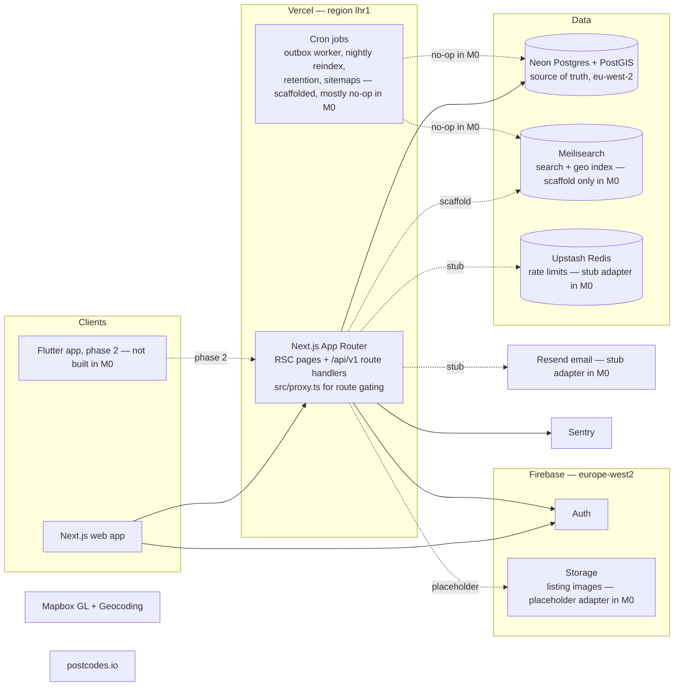
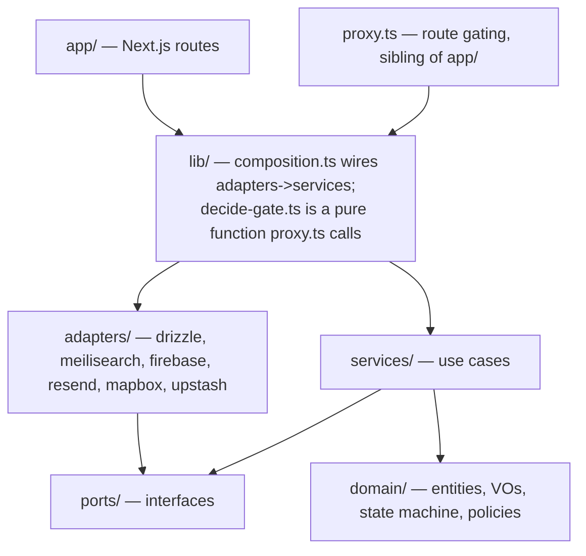
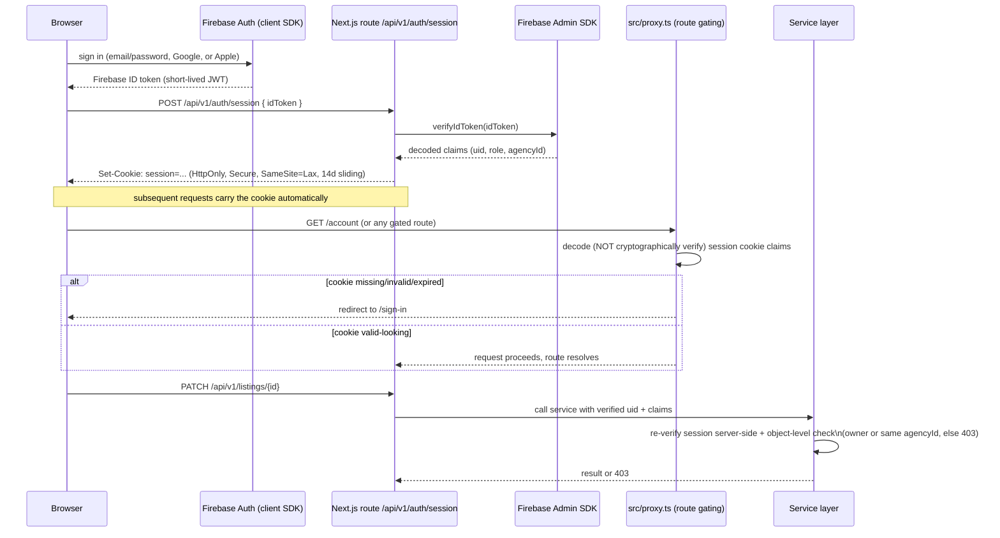

# Doorstep — Architecture

Status: living document, canonical as of M0 (Foundation). Update it whenever a
boundary, port, or infrastructure decision changes; do not let it drift from
the code. Source of requirements: `docs/PRD.md` (referenced by section below).

---

## 1. System overview

Doorstep is a UK property marketplace: Next.js 16 (App Router, TypeScript) on
Vercel, Neon Postgres + PostGIS as the single source of truth, Meilisearch as
a disposable search projection, Firebase for Auth and Storage, and a small
set of UK-appropriate integrations (Mapbox, postcodes.io, Resend, Upstash
Redis, Cloudflare Turnstile). PRD §8.1 is the canonical stack table; this
document explains *why the code is organised the way it is* and *how the
pieces talk to each other*.

The system diagram below adapts PRD §8.2 with M0 emphasis: in M0 the search,
image, email and rate-limiting adapters exist as ports with placeholder or
minimal implementations — see §8 "What M0 stubs".



M0 does not stand up Mapbox, postcodes.io, Stripe or Turnstile integrations —
those land in M1–M4 alongside the features that need them (PRD §13).

---

## 2. Monorepo layout

pnpm workspace, single deployable app in M0 (`apps/web`); the workspace shape
exists from day one so a future `apps/admin-jobs` or a Flutter-adjacent
`packages/api-types` package (phase 2, PRD §16) does not require a restructure.

```
doorstep/
  apps/
    web/
      src/
        app/            Next.js routes only — see §3
        proxy.ts        Route gating for /account, /lister, /admin — a
                         sibling of app/, not a route inside it. Next.js 16
                         renamed the middleware.ts convention to proxy.ts;
                         see §4.
        domain/         entities, value objects, state machine, policies
        services/       use cases orchestrating ports
        ports/          interfaces the domain/services depend on
        adapters/       concrete implementations of ports, incl.
                         adapters/drizzle/ (schema.ts + migrations/ live
                         here, not in a top-level drizzle/ directory)
        components/     ui/ primitives + feature components
        lib/            composition root (lib/composition.ts), route-gating
                         decision logic (lib/decide-gate.ts), config, shared
                         Zod schemas
      tests/
        unit/           domain + services + filter builders, in-memory fakes
        integration/    adapters against real containers (Postgres/PostGIS)
        e2e/            Playwright, critical journeys (PRD §8.8)
      scripts/          seed.ts, seed-data.ts, assert-seed-count.ts — the
                         PRD's M0 "seed script" exit criterion
      drizzle.config.ts drizzle-kit config; points at src/adapters/drizzle/
  packages/             no packages exist yet — pnpm-workspace.yaml reserves
                         the `packages/*` glob for a future shared types
                         package (phase 2 Flutter, PRD §16)
  pnpm-workspace.yaml
  .github/workflows/    ci.yml — jobs: typecheck, lint, unit, integration,
                         build, e2e
```

This is a direct implementation of PRD §8.5's `src/` layout, wrapped in a
pnpm workspace so CI, linting and future packages have a natural home without
touching `apps/web` internals.

---

## 3. The dependency rule

Dependencies point one way: inward, toward the domain. Nothing in
`domain/` or `services/` is allowed to import a framework, a database
client, or an HTTP concern.



Rules, concretely:

- **`domain/`** — pure TypeScript. Entities (Property, Enquiry, Agency,
  User), value objects (Money, GeoPoint), the listing state
  machine (PRD §9.3), and moderation/authorisation policy objects. Zero
  imports from Next.js, Drizzle, Firebase, or any adapter package. Fully
  unit-testable without a database.
- **`services/`** — use cases (`EstablishSession`, `TerminateSession`,
  `GetCurrentUser` land in M0; `PublishListing`, `SubmitEnquiry`,
  `ApproveListing` follow in later milestones). Each service takes its
  dependencies as **port** interfaces via constructor injection.
  Services orchestrate; they contain no SQL, no HTTP, no Firebase SDK calls.
- **`ports/`** — interfaces only, one file per port:
  `ListingReader`/`ListingWriter` (an ISP split of `ListingRepository`),
  `UserRepository`, `SearchIndex`, `ImageStorage`, `Mailer`, `Geocoder`,
  `RateLimiter`, `Clock`, `AuthGateway`. Owned by the domain/services side of
  the boundary — adapters depend on ports, not the other way round (DIP). An
  `OutboxRepository` port does not exist yet: M0 has the `outbox` domain
  entity (`domain/outbox.ts`) and the Drizzle table, but no port or service
  writes to it until the drain worker lands in M2 (ADR-0005).
- **`adapters/`** — one folder per external system (`drizzle/`,
  `meilisearch/`, `firebase/`, `resend/`, `mapbox/`, plus `upstash/` and the
  standalone `system-clock.ts`). Each adapter implements one or more ports
  and translates between the vendor's SDK/wire format and domain types.
  Adapters may freely import vendor SDKs; nothing outside `adapters/` and
  `lib/composition.ts` may import a vendor SDK directly. In M0, only
  `adapters/firebase` (auth) and `adapters/drizzle` (users) have a real
  implementation — `meilisearch/`, `resend/`, `mapbox/`, `upstash/`, and the
  Storage half of `firebase/` are empty scaffolds (`export {}`) — see §8.
- **`app/`** — Next.js route handlers and RSC pages only. A route handler
  parses/validates the request (Zod), resolves a service from the
  composition root, calls it, and maps the result to a response. No
  business logic lives here (PRD §8.5 SRP point).
- **`lib/composition.ts`** — the single place where adapters are
  constructed and wired into services (`createServices()`). Test code
  substitutes in-memory fakes here instead of real adapters — this is what
  makes the TDD loop in PRD §8.8 possible without hitting Postgres or
  Firebase for domain/service tests.

### Enforcement

The dependency rule is enforced by ESLint's `no-restricted-imports` rule,
configured per directory in `apps/web/eslint.config.mjs` — not a dedicated
boundaries plugin, and not left to code-review discipline alone:

- `src/domain/**` and `src/services/**`: one rule block bans imports
  matching `next`/`next/*`, `react`/`react-dom` (and their subpaths),
  `drizzle-orm`/`drizzle-orm/*`, `firebase`/`firebase-admin` (and their
  subpaths), and `@/adapters/*`/`**/adapters/**`.
- `src/app/**`: a second rule block bans `@/adapters/*`/`**/adapters/**`
  imports, forcing routes through `@/lib/composition`'s `createServices()`.
- There is currently no lint rule restricting what `adapters/**` itself may
  import — by convention adapters import vendor SDKs freely and import from
  `ports/`/`domain/` to translate types, but unlike the two rules above,
  this is not mechanically enforced today.

A CI lint failure on a boundary violation blocks merge — the `lint` job in
`.github/workflows/ci.yml` runs `pnpm lint` on every PR (PRD §8.8 quality
gates) — this is the mechanical guarantee behind the SOLID rationale in PRD
§8.5, not just documentation.

---

## 4. Auth flow (PRD §7.4, §8.4)

Firebase Auth issues identity; Doorstep issues its own server-side session.
The web app never sends a Firebase ID token on every request — it exchanges
it once for an HTTP-only cookie.

Next.js 16 renamed the `middleware.ts` file convention to `proxy.ts` (same
request-intercepting mechanism, new filename and export name). Doorstep's
route gating lives at `apps/web/src/proxy.ts`; the sequence diagram below
labels that participant `src/proxy.ts` rather than the generic "middleware"
term PRD §8.4 uses, to keep this document traceable to the actual file.



Key properties, traceable to PRD §7.4 and §8.4:

- **Two-tier trust**: `src/proxy.ts` performs cheap route-gating (is there a
  session cookie at all — redirect anonymous users away from `/account`,
  `/list`, `/admin`). It deliberately does **not** cryptographically verify
  the cookie's signature (see the doc comment on `src/lib/decide-gate.ts`)
  — it only decodes the claims to make a fast UX decision, since it runs on
  every matched navigation including prefetches. The **service layer
  performs the real authorisation** — object-level checks (owner or same
  `agencyId`, admin role) on every mutation, via
  `AuthGateway.verifySessionCookie` and `services/authz/policies.ts`.
  `src/proxy.ts` is a UX convenience, never the security boundary.
- **Cookie shape**: HTTP-only, Secure, `SameSite=Lax`, 14-day expiry,
  sliding (refreshed on activity — see `src/lib/session.ts`). Chosen over
  sending the raw Firebase ID token per-request because ID tokens are
  short-lived (~1h) and would either force silent client-side refresh
  plumbing or leak into every request/log; a server session cookie
  centralises verification and revocation.
- **Roles as custom claims**: `{ role: 'user' | 'owner' | 'agent' | 'admin', agencyId?: string }`,
  mirrored from the `users.role` / `users.agency_id` columns (PRD §9.2).
  Role upgrades (private owner → nothing to do; user → agent joining an
  agency) are server-driven; claims refresh on next token refresh, forced
  immediately after an upgrade so the new role is usable without a manual
  re-login.
- **The full authorisation matrix** (guest/user/owner/agent/admin ×
  capability) is PRD §8.4's table; M0 only needs to prove the mechanics —
  sign up, sign in, sign out, and a session that round-trips role claims —
  not the full matrix, which is exercised as each milestone adds the
  capabilities it gates.

---

## 5. Data layer

Full schema is PRD §9; this section covers the architectural decisions that
recur across every table.

- **Primary keys are UUID v7.** Time-ordered (unlike v4), so B-tree
  indexes on `id` and any `id`-derived pagination stay well-behaved, while
  still being safe to expose in URLs/APIs without leaking sequential
  counts (unlike serial ints). See ADR-0004.
- **Money is stored as integer pounds/pcm, never floats.** Sale prices
  are whole pounds; rents are whole pounds-per-calendar-month. No currency
  subunit table is needed because the product is UK-only and GBP-only in
  MVP (PRD §9). See ADR-0004.
- **Status fields carry lifecycle; no soft-delete boolean.** `properties.status`
  is an enum driving a domain state machine (`draft → pending_review →
  published → under_offer → completed → archived`, with `rejected` and
  `hidden` branches, implemented in `src/domain/property-status-machine.ts`)
  — PRD §9.3. Invalid transitions are rejected in one place (`domain/`),
  unit-tested exhaustively, so no call site can put a listing into an
  impossible state.
- **Transactional outbox for search sync.** Every visibility-relevant
  mutation writes an `outbox` row in the *same* Postgres transaction as
  the mutation (PRD §8.6, §9.2). This guarantees the projection to
  Meilisearch is eventually consistent with Postgres even if the process
  crashes mid-mutation — there is no window where a listing is published
  in Postgres but the outbox write was skipped. See ADR-0005. In M0 the
  `outbox` table and its Drizzle types exist and are written to by the
  (not-yet-built) listing services in later milestones; the drain worker
  is a scaffolded Vercel Cron entry that is a safe no-op until M2.
- **PostGIS for location.** `properties.location` is
  `geography(Point, 4326)` with a GIST index, enabling efficient
  radius/bbox queries directly in Postgres as a fallback/reconciliation
  path even though the hot query path for search is Meilisearch's
  `_geoRadius`/`_geoBoundingBox` (PRD §8.6). M0 creates the extension
  (`src/adapters/drizzle/migrations/0000_enable_extensions.sql`) and the
  indexed column; no geo query endpoints exist yet.
- **Firebase is the identity source of truth; Postgres mirrors it.**
  `users.firebase_uid` is the join key; `email`, `role`, `agency_id` are
  mirrored into Postgres for query convenience (search users by
  name/email, join listings to listers) and are kept in sync by the
  session-exchange and admin services, not by a separate sync job.

---

## 6. Environments

| Concern | Choice | Why |
| --- | --- | --- |
| Hosting | Vercel, functions pinned to `lhr1` (London) | UK data-residency preference and lowest latency to UK users (PRD §7.5) |
| Database | Neon Postgres, `eu-west-2` (AWS London) | Data residency; branch databases per Vercel preview deployment give every PR an isolated schema + seed without shared-state flakiness |
| Auth/Storage | Firebase, `europe-west2` region resources | Data residency to match Neon/Vercel |
| Search | Meilisearch Cloud, EU region (scaffold only in M0) | Data residency; not provisioned/exercised until M2 |
| Environments | Separate Firebase projects and Neon databases for dev, preview, and prod | No shared credentials or data between environments; a bug in preview cannot touch prod data (PRD §7.4, §17) |

Preview deploys: each PR gets a Vercel preview build wired to a **fresh Neon
branch database** (schema + seed applied via CI), so integration tests and
manual QA against a preview URL never share state with prod or with other
open PRs. This is the mechanism that lets `M0`'s exit criterion — "sign up,
sign in, sign out on prod URL; CI blocks on gates; schema deployed with
PostGIS enabled" (PRD §13) — be verified on real infrastructure rather than
mocked infrastructure.

Secrets live only in Vercel environment variables, scoped per environment;
no `.env` files with real credentials are committed (PRD §7.4). See the root
`README.md`'s Setup section for the manual account-creation steps this
table assumes.

---

## 7. Rendering strategy

Direct from PRD §8.3, restated here because it drives where in `app/`
new routes belong and which are candidates for the composition root's
"anonymous vs authenticated" service resolution:

| Surface | Strategy | M0 status |
| --- | --- | --- |
| Home, area landing pages | ISR, revalidated daily or on demand | Placeholder shell only in M0 |
| Search results (list and map) | Client-driven UI calling `GET /api/v1/search`; shell server-renders with initial results for SEO on crawlable filter URLs | Not built in M0 (M2/M3) |
| Listing detail | ISR, on-demand revalidation on publish/edit/status change | Not built in M0 (M1/M2) |
| Agency pages | ISR, revalidated on agency edits | Not built in M0 (M1) |
| Dashboards (lister, admin), account | Dynamic server components, no caching, auth-gated | M0 delivers the account shell (sign up/in/out) as the first dynamic, auth-gated surface |

---

## 8. What M0 deliberately stubs

M0's exit criteria (PRD §13) are narrow on purpose: repo, CI gates, cloud
projects, schema + migrations, auth with session cookies and roles, app
shell, seed script. Everything else in the stack is represented as a
**port with a placeholder or minimal adapter**, not omitted from the
architecture — this is what lets M1 onward add real behaviour by writing a
new adapter and a composition-root wiring change, never by restructuring
`domain/` or `services/`.

| Capability | Port exists in M0? | Adapter in M0 | Real adapter lands |
| --- | --- | --- | --- |
| Search (`SearchIndex`) | Yes | `adapters/meilisearch/` is an empty scaffold (`export {}`) | M2 |
| Image storage (`ImageStorage`) | Yes | Not implemented — `adapters/firebase/` only has Auth so far | M1 |
| Email (`Mailer`) | Yes | `adapters/resend/` is an empty scaffold (`export {}`) | M4 (enquiry emails), earlier if auth emails need it |
| Rate limiting (`RateLimiter`) | Yes | `adapters/upstash/` is an empty scaffold (`export {}`) | M4 (enquiries), tightened per PRD §7.4 limits |
| Geocoding (`Geocoder`) | Yes | `adapters/mapbox/` is an empty scaffold (`export {}`) | M2 |
| Outbox drain worker | Table + domain type exist; no port yet | Cron entry scaffolded as a no-op | M2 |

Explicitly, M0 does **not** build: the listing wizard, image pipeline, search
API, map view, enquiries, or admin queue. Those are M1–M5 (PRD §13). M0's
job is the foundation those milestones build on: a correctly-bounded
codebase, a working auth round-trip against real infrastructure, and a
schema that already has the shape (including PostGIS, the outbox, and
Stripe-reserved tables per PRD §9.2) that later milestones need without a
disruptive migration.

---

## Related documents

- `adr/0001-layered-architecture-with-ports-and-adapters.md`
- `adr/0002-firebase-auth-with-server-session-cookies.md`
- `adr/0003-postgres-postgis-source-of-truth-meilisearch-projection.md`
- `adr/0004-drizzle-orm-uuidv7-integer-money.md`
- `adr/0005-transactional-outbox-for-search-sync.md`
- `PRD.md` — product requirements, source of all constraints cited above
