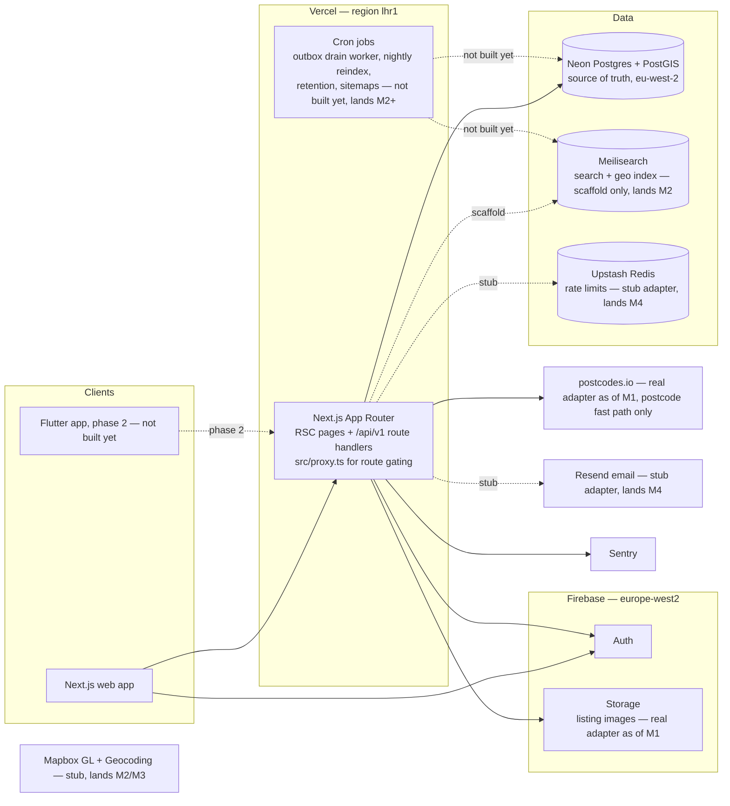
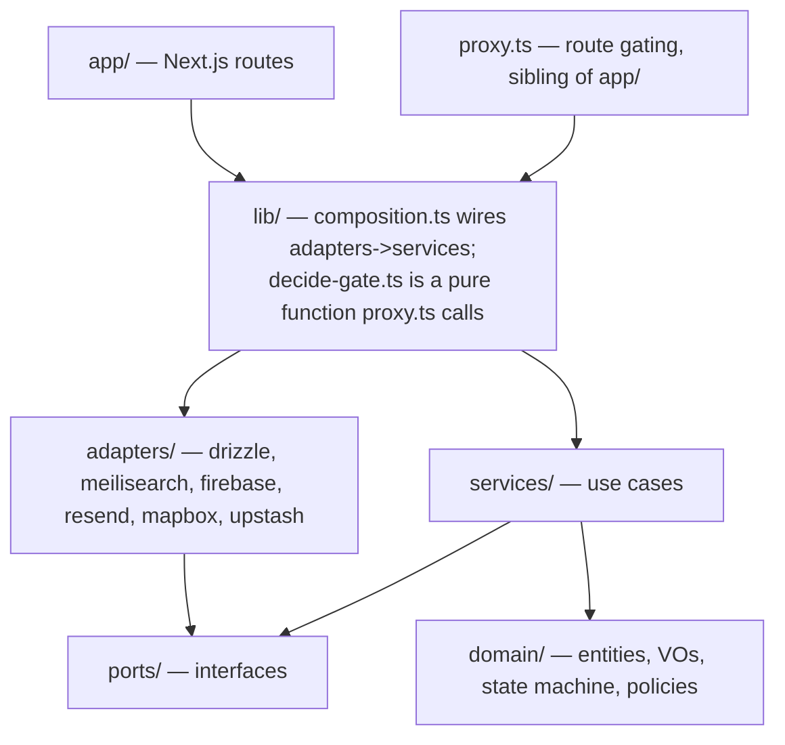
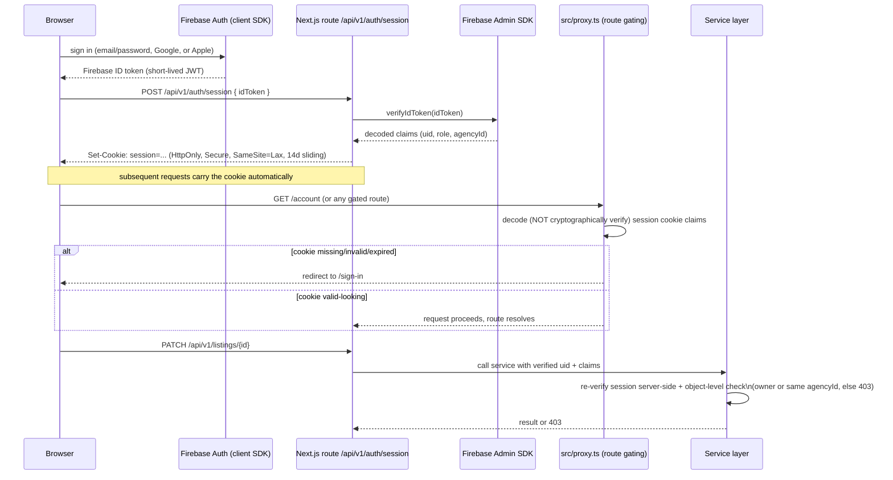
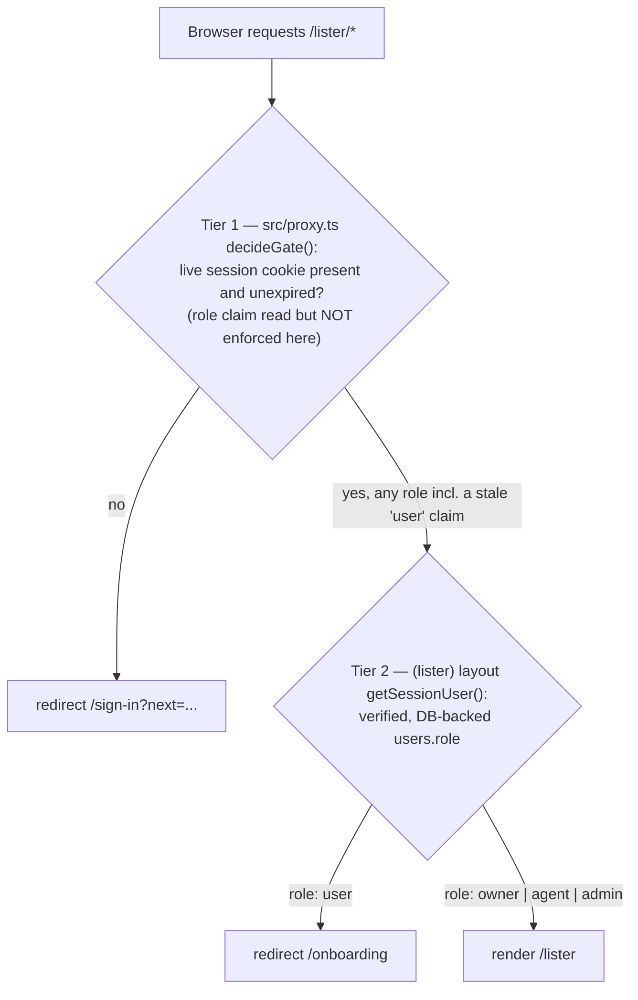

# Doorstep — Architecture

Status: living document, canonical as of M1 (Listing CRUD + images). Update
it whenever a boundary, port, or infrastructure decision changes; do not let
it drift from the code. Source of requirements: `docs/PRD.md` (referenced by
section below).

---

## 1. System overview

Doorstep is a UK property marketplace: Next.js 16 (App Router, TypeScript) on
Vercel, Neon Postgres + PostGIS as the single source of truth, Meilisearch as
a disposable search projection, Firebase for Auth and Storage, and a small
set of UK-appropriate integrations (Mapbox, postcodes.io, Resend, Upstash
Redis, Cloudflare Turnstile). PRD §8.1 is the canonical stack table; this
document explains *why the code is organised the way it is* and *how the
pieces talk to each other*.

The system diagram below adapts PRD §8.2 with M0/M1 emphasis: search, email
and rate-limiting still exist only as ports with placeholder scaffolds;
image storage and the postcode half of geocoding are real as of M1 — see §8
"What M1 still stubs".



M0 did not stand up Mapbox, postcodes.io, Stripe or Turnstile integrations;
M1 wired postcodes.io for the postcode fast path (§12) and Firebase Storage
for the image pipeline (§11). Mapbox, Stripe and Turnstile still land in
M2–M4 alongside the features that need them (PRD §13).

---

## 2. Monorepo layout

pnpm workspace, single deployable app in M0 (`apps/web`); the workspace shape
exists from day one so a future `apps/admin-jobs` or a Flutter-adjacent
`packages/api-types` package (phase 2, PRD §16) does not require a restructure.

```
doorstep/
  apps/
    web/
      src/
        app/            Next.js routes only — see §3
        proxy.ts        Route gating for /account, /lister, /admin — a
                         sibling of app/, not a route inside it. Next.js 16
                         renamed the middleware.ts convention to proxy.ts;
                         see §4.
        domain/         entities, value objects, state machine, policies
        services/       use cases orchestrating ports
        ports/          interfaces the domain/services depend on
        adapters/       concrete implementations of ports, incl.
                         adapters/drizzle/ (schema.ts + migrations/ live
                         here, not in a top-level drizzle/ directory)
        components/     ui/ primitives + feature components
        lib/            composition root (lib/composition.ts), route-gating
                         decision logic (lib/decide-gate.ts), config, shared
                         Zod schemas
      tests/
        unit/           domain + services + filter builders, in-memory fakes
        integration/    adapters against real containers (Postgres/PostGIS)
        e2e/            Playwright, critical journeys (PRD §8.8)
      scripts/          seed.ts, seed-data.ts, assert-seed-count.ts — the
                         PRD's M0 "seed script" exit criterion
      drizzle.config.ts drizzle-kit config; points at src/adapters/drizzle/
  packages/             no packages exist yet — pnpm-workspace.yaml reserves
                         the `packages/*` glob for a future shared types
                         package (phase 2 Flutter, PRD §16)
  pnpm-workspace.yaml
  .github/workflows/    ci.yml — jobs: typecheck, lint, unit, integration,
                         build, e2e
```

This is a direct implementation of PRD §8.5's `src/` layout, wrapped in a
pnpm workspace so CI, linting and future packages have a natural home without
touching `apps/web` internals.

---

## 3. The dependency rule

Dependencies point one way: inward, toward the domain. Nothing in
`domain/` or `services/` is allowed to import a framework, a database
client, or an HTTP concern.



Rules, concretely:

- **`domain/`** — pure TypeScript. Entities (Property, Enquiry, Agency,
  User), value objects (Money, GeoPoint), the listing state
  machine (PRD §9.3), and moderation/authorisation policy objects. Zero
  imports from Next.js, Drizzle, Firebase, or any adapter package. Fully
  unit-testable without a database.
- **`services/`** — use cases: `EstablishSession`, `TerminateSession`,
  `GetCurrentUser` landed in M0; `BecomeOwner`, `CreateAgency`,
  `CreateListingDraft`, `UpdateListing`, `SubmitListing`,
  `ChangeListingStatus`, `DeleteListing`, `RequestImageUpload`,
  `ProcessImage` and friends landed in M1 (§9–§11); `PublishListing`
  (admin-side), `SubmitEnquiry`, `ApproveListing` follow in later
  milestones. Each service takes its dependencies as **port** interfaces
  via constructor injection. Services orchestrate; they contain no SQL, no
  HTTP, no Firebase SDK calls.
- **`ports/`** — interfaces only, one file per port:
  `ListingReader`/`ListingWriter` (an ISP split of `ListingRepository`),
  `PropertyImageReader`/`PropertyImageWriter` (the same ISP split applied to
  images), `UserRepository`, `AgencyRepository`, `SearchIndex`,
  `ImageStorage`, `Mailer`, `Geocoder`, `RateLimiter`, `Clock`,
  `AuthGateway`. Owned by the domain/services side of the boundary
  — adapters depend on ports, not the other way round (DIP). An
  `OutboxRepository` port still does not exist: the `outbox` domain entity
  (`domain/outbox.ts`) and the Drizzle table exist since M0, and as of M1
  `ListingWriter` (implemented by `DrizzleListingRepository`, not a
  separate outbox port) writes real rows to it on every visibility-relevant
  mutation (§10) — but nothing *reads* the table yet, since no drain
  worker exists until M2 (ADR-0005).
- **`adapters/`** — one folder per external system (`drizzle/`,
  `meilisearch/`, `firebase/`, `postcodesio/`, `resend/`, `mapbox/`, plus
  `upstash/` and the standalone `system-clock.ts`). Each adapter implements
  one or more ports and translates between the vendor's SDK/wire format and
  domain types. Adapters may freely import vendor SDKs; nothing outside
  `adapters/` and `lib/composition.ts` may import a vendor SDK directly. As
  of M1, `adapters/drizzle` (users, agencies, listings, property images),
  `adapters/firebase` (Auth and Storage) and `adapters/postcodesio` (the UK
  postcode fast path) have real implementations; `meilisearch/`, `resend/`,
  `upstash/`, and `mapbox/` (free-text place search) remain empty scaffolds
  (`export {}`) — see §8.
- **`app/`** — Next.js route handlers and RSC pages only. A route handler
  parses/validates the request (Zod), resolves a service from the
  composition root, calls it, and maps the result to a response. No
  business logic lives here (PRD §8.5 SRP point).
- **`lib/composition.ts`** — the single place where adapters are
  constructed and wired into services (`createServices()`). Test code
  substitutes in-memory fakes here instead of real adapters — this is what
  makes the TDD loop in PRD §8.8 possible without hitting Postgres or
  Firebase for domain/service tests.

### Enforcement

The dependency rule is enforced by ESLint's `no-restricted-imports` rule,
configured per directory in `apps/web/eslint.config.mjs` — not a dedicated
boundaries plugin, and not left to code-review discipline alone:

- `src/domain/**` and `src/services/**`: one rule block bans imports
  matching `next`/`next/*`, `react`/`react-dom` (and their subpaths),
  `drizzle-orm`/`drizzle-orm/*`, `firebase`/`firebase-admin` (and their
  subpaths), and `@/adapters/*`/`**/adapters/**`.
- `src/app/**`: a second rule block bans `@/adapters/*`/`**/adapters/**`
  imports, forcing routes through `@/lib/composition`'s `createServices()`.
- There is currently no lint rule restricting what `adapters/**` itself may
  import — by convention adapters import vendor SDKs freely and import from
  `ports/`/`domain/` to translate types, but unlike the two rules above,
  this is not mechanically enforced today.

A CI lint failure on a boundary violation blocks merge — the `lint` job in
`.github/workflows/ci.yml` runs `pnpm lint` on every PR (PRD §8.8 quality
gates) — this is the mechanical guarantee behind the SOLID rationale in PRD
§8.5, not just documentation.

---

## 4. Auth flow (PRD §7.4, §8.4)

Firebase Auth issues identity; Doorstep issues its own server-side session.
The web app never sends a Firebase ID token on every request — it exchanges
it once for an HTTP-only cookie.

Next.js 16 renamed the `middleware.ts` file convention to `proxy.ts` (same
request-intercepting mechanism, new filename and export name). Doorstep's
route gating lives at `apps/web/src/proxy.ts`; the sequence diagram below
labels that participant `src/proxy.ts` rather than the generic "middleware"
term PRD §8.4 uses, to keep this document traceable to the actual file.



Key properties, traceable to PRD §7.4 and §8.4:

- **Two-tier trust**: `src/proxy.ts` performs cheap route-gating (is there a
  session cookie at all — redirect anonymous users away from `/account`,
  `/list`, `/admin`). It deliberately does **not** cryptographically verify
  the cookie's signature (see the doc comment on `src/lib/decide-gate.ts`)
  — it only decodes the claims to make a fast UX decision, since it runs on
  every matched navigation including prefetches. The **service layer
  performs the real authorisation** — object-level checks (owner or same
  `agencyId`, admin role) on every mutation, via
  `AuthGateway.verifySessionCookie` and `services/authz/policies.ts`.
  `src/proxy.ts` is a UX convenience, never the security boundary.
- **Cookie shape**: HTTP-only, Secure, `SameSite=Lax`, 14-day expiry,
  sliding (refreshed on activity — see `src/lib/session.ts`). Chosen over
  sending the raw Firebase ID token per-request because ID tokens are
  short-lived (~1h) and would either force silent client-side refresh
  plumbing or leak into every request/log; a server session cookie
  centralises verification and revocation.
- **Roles as custom claims**: `{ role: 'user' | 'owner' | 'agent' | 'admin', agencyId?: string }`,
  mirrored from the `users.role` / `users.agency_id` columns (PRD §9.2).
  Role upgrades (private owner → nothing to do; user → agent joining an
  agency) are server-driven; claims refresh on next token refresh, forced
  immediately after an upgrade so the new role is usable without a manual
  re-login.
- **The full authorisation matrix** (guest/user/owner/agent/admin ×
  capability) is PRD §8.4's table; M0 only needs to prove the mechanics —
  sign up, sign in, sign out, and a session that round-trips role claims —
  not the full matrix, which is exercised as each milestone adds the
  capabilities it gates.

---

## 5. Data layer

Full schema is PRD §9; this section covers the architectural decisions that
recur across every table.

- **Primary keys are UUID v7.** Time-ordered (unlike v4), so B-tree
  indexes on `id` and any `id`-derived pagination stay well-behaved, while
  still being safe to expose in URLs/APIs without leaking sequential
  counts (unlike serial ints). See ADR-0004.
- **Money is stored as integer pounds/pcm, never floats.** Sale prices
  are whole pounds; rents are whole pounds-per-calendar-month. No currency
  subunit table is needed because the product is UK-only and GBP-only in
  MVP (PRD §9). See ADR-0004.
- **Status fields carry lifecycle; no soft-delete boolean.** `properties.status`
  is an enum driving a domain state machine (`draft → pending_review →
  published → under_offer → completed → archived`, with `rejected` and
  `hidden` branches, implemented in `src/domain/property-status-machine.ts`)
  — PRD §9.3. Invalid transitions are rejected in one place (`domain/`),
  unit-tested exhaustively, so no call site can put a listing into an
  impossible state.
- **Transactional outbox for search sync.** Every visibility-relevant
  mutation writes an `outbox` row in the *same* Postgres transaction as
  the mutation (PRD §8.6, §9.2). This guarantees the projection to
  Meilisearch is eventually consistent with Postgres even if the process
  crashes mid-mutation — there is no window where a listing is published
  in Postgres but the outbox write was skipped. See ADR-0005. As of M1,
  `ListingWriter.transitionWithOutbox` and `.updateWithSideEffects`
  (`src/adapters/drizzle/repositories/listing-repository.ts`) write real
  `outbox` rows for real status transitions and published-listing edits
  (§10) — this is no longer a not-yet-built path. Nothing drains the
  table yet, though: there is no `OutboxRepository` port, no Vercel Cron
  entry, and no `crons` block in `apps/web/vercel.json` at all today (M0's
  original plan to scaffold a no-op cron entry was simplified away rather
  than built) — rows accumulate correctly and durably, but nothing
  consumes them, and no M1 listing is indexed anywhere, until the drain
  worker lands in M2.
- **PostGIS for location.** `properties.location` is
  `geography(Point, 4326)` with a GIST index, enabling efficient
  radius/bbox queries directly in Postgres as a fallback/reconciliation
  path even though the hot query path for search is Meilisearch's
  `_geoRadius`/`_geoBoundingBox` (PRD §8.6). M0 creates the extension
  (`src/adapters/drizzle/migrations/0000_enable_extensions.sql`) and the
  indexed column; no geo query endpoints exist yet.
- **Firebase is the identity source of truth; Postgres mirrors it.**
  `users.firebase_uid` is the join key; `email`, `role`, `agency_id` are
  mirrored into Postgres for query convenience (search users by
  name/email, join listings to listers) and are kept in sync by the
  session-exchange and admin services, not by a separate sync job.

---

## 6. Environments

| Concern | Choice | Why |
| --- | --- | --- |
| Hosting | Vercel, functions pinned to `lhr1` (London) | UK data-residency preference and lowest latency to UK users (PRD §7.5) |
| Database | Neon Postgres, `eu-west-2` (AWS London) | Data residency; branch databases per Vercel preview deployment give every PR an isolated schema + seed without shared-state flakiness |
| Auth/Storage | Firebase, `europe-west2` region resources | Data residency to match Neon/Vercel |
| Search | Meilisearch Cloud, EU region (scaffold only in M0) | Data residency; not provisioned/exercised until M2 |
| Environments | Separate Firebase projects and Neon databases for dev, preview, and prod | No shared credentials or data between environments; a bug in preview cannot touch prod data (PRD §7.4, §17) |

Preview deploys: each PR gets a Vercel preview build wired to a **fresh Neon
branch database** (schema + seed applied via CI), so integration tests and
manual QA against a preview URL never share state with prod or with other
open PRs. This is the mechanism that lets `M0`'s exit criterion — "sign up,
sign in, sign out on prod URL; CI blocks on gates; schema deployed with
PostGIS enabled" (PRD §13) — be verified on real infrastructure rather than
mocked infrastructure.

Secrets live only in Vercel environment variables, scoped per environment;
no `.env` files with real credentials are committed (PRD §7.4). See the root
`README.md`'s Setup section for the manual account-creation steps this
table assumes.

---

## 7. Rendering strategy

Direct from PRD §8.3, restated here because it drives where in `app/`
new routes belong and which are candidates for the composition root's
"anonymous vs authenticated" service resolution:

| Surface | Strategy | Status as of M1 |
| --- | --- | --- |
| Home, area landing pages | ISR, revalidated daily or on demand | Placeholder shell only |
| Search results (list and map) | Client-driven UI calling `GET /api/v1/search`; shell server-renders with initial results for SEO on crawlable filter URLs | Not built yet (M2/M3) |
| Listing detail | ISR, on-demand revalidation on publish/edit/status change | Not built yet — no public `/api/v1/properties/{slug}` route exists; search (M2) and detail-page finalisation (M4) per PRD §13 |
| Agency pages | ISR, revalidated on agency edits | Not built yet — no public `/agency/{slug}` route exists; M1 only built the *creation* form (§9), not the public page |
| Dashboards (lister, admin), account | Dynamic server components, no caching, auth-gated | M0 delivered the account shell (sign up/in/out); M1 added the full `/lister` dashboard, the create-listing wizard, and `/onboarding` on the same pattern (§9, §10) |

---

## 8. What M0 deliberately stubs

This table was written at the end of M0; it is kept below (heading text and
anchor unchanged, since `README.md` and `docs/CONTRIBUTING.md` link to it by
section number) and its contents updated in place as each capability moves
from stub to real adapter, rather than duplicated into a second table. Read
it as "what's still stubbed after the milestones completed so far," not as
an M0-only snapshot.

M0's exit criteria (PRD §13) were narrow on purpose: repo, CI gates, cloud
projects, schema + migrations, auth with session cookies and roles, app
shell, seed script. Everything else in the stack was represented as a
**port with a placeholder or minimal adapter**, not omitted from the
architecture — this is what lets each milestone add real behaviour by
writing a new adapter and a composition-root wiring change, never by
restructuring `domain/` or `services/`. M1 has since filled in two of the
six rows below (image storage, and the postcode half of geocoding).

| Capability | Port exists? | Adapter today | Real adapter lands |
| --- | --- | --- | --- |
| Search (`SearchIndex`) | Yes | `adapters/meilisearch/` is an empty scaffold (`export {}`) | M2 |
| Image storage (`ImageStorage`) | Yes | **Real as of M1** — `adapters/firebase/firebase-storage-adapter.ts` (signed uploads, variant writes, download-token public URLs). See §11 | Done (M1) |
| Email (`Mailer`) | Yes | `adapters/resend/` is an empty scaffold (`export {}`) | M4 (enquiry emails), earlier if auth emails need it |
| Rate limiting (`RateLimiter`) | Yes | `adapters/upstash/` is an empty scaffold (`export {}`) | M4 (enquiries), tightened per PRD §7.4 limits |
| Geocoding (`Geocoder`) | Yes | **Partially real as of M1** — `adapters/postcodesio/` resolves full and partial UK postcodes (§12); `adapters/mapbox/` (free-text place search, GB-biased) is still an empty scaffold | Postcode fast path done (M1); Mapbox place search M2 |
| Outbox drain worker | `outbox` table + domain type exist; the table is written to for real by M1's listing services (§5, §10) | No `OutboxRepository` port, no Vercel Cron entry, no `crons` block in `vercel.json` — nothing reads the table yet | M2 |

Explicitly, M0 did **not** build: the listing wizard, image pipeline, search
API, map view, enquiries, or admin queue. M1 built the first two of those
(§9–§12 below); search, map, enquiries and admin remain M2–M5 (PRD §13).
M0's job was the foundation those milestones build on: a correctly-bounded
codebase, a working auth round-trip against real infrastructure, and a
schema that already has the shape (including PostGIS, the outbox, and
Stripe-reserved tables per PRD §9.2) that later milestones need without a
disruptive migration.

---

## 9. Lister onboarding and the two-tier role gate (M1)

PRD §6.5 LST-1. A signed-up `user` becomes a lister one of two ways, both
behind `POST /api/v1/onboarding/*` and both re-verifying the session cookie
server-side rather than trusting any client-supplied role:

- **`POST /api/v1/onboarding/owner`** (`services/listers/become-owner.ts`) —
  instant: a plain `user` (only) becomes `owner`. No new row; `agencyId`
  stays null.
- **`POST /api/v1/onboarding/agency`** (`services/listers/create-agency.ts`)
  — a `user` or an existing `owner` creates an `agencies` row (`verified:
  false`, deduplicated slug with a single-retry race guard) and becomes
  `agent` on it. Joining an *existing* agency (the PRD's "requests to join,
  approved by the agency creator" path) is explicitly out of scope for M1.

Both services call `AuthGateway.setRoleClaims` so *future* session mints
carry the new role — but the caller's own already-active session cookie
keeps its stale `role: user` claim until the client completes a claims
refresh (`lib/firebase-client.ts`'s `refreshSessionAfterUpgrade`), which
requires a live Firebase Auth user only available in the same tab,
immediately after the onboarding call. This is exactly why role claims in
the session cookie are a UX signal, never an authorisation source (§4): a
route or layout that trusted the claim would bounce a freshly-upgraded
owner back to sign-in on every single upgrade.

That staleness is why `/lister` and `/onboarding` use **two gate tiers**
instead of one, both implemented as of M1 (`src/lib/decide-gate.ts`,
`src/app/(lister)/layout.tsx`):



- **Tier 1 (`src/proxy.ts`, edge-of-request, every matched navigation
  including prefetches):** session presence only for `/lister` and
  `/onboarding` — deliberately *not* role-gated, unlike `/admin`, which
  keeps the stricter claims check because an admin claim is never granted
  as the immediate next step after the user's own in-session action, so
  there is no equivalent staleness window to protect against.
- **Tier 2, `/lister`** (`(lister)` layout, `src/app/(lister)/layout.tsx`,
  diagrammed above): the real owner/agent/admin check, against
  `getSessionUser()`'s verified, DB-backed `users.role` — a plain `user`
  reaching this far (stale claim or otherwise) is redirected to
  `/onboarding`, never shown a bare 401/404.
- **Tier 2, `/onboarding`** (`src/app/(account)/onboarding/page.tsx`, not a
  layout — `/onboarding` sits in the `(account)` route group, which has no
  role-checking layout of its own): the mirror-image check, inline in the
  page component — `role !== 'user'` (already onboarded, stale claim or
  not) redirects straight to `/lister`, since there's nothing left to
  choose; `role === 'user'` renders the role-choice screen.

Nothing here is the actual authorisation boundary either: every mutating
service (`BecomeOwner`, `CreateAgency`, and every `services/listings/*` /
`services/images/*` use case) re-derives its own decision from the actor
object `GetCurrentUser` resolved from the verified cookie — `requireRole`
for role-gated actions, `canManageListing` for object-level listing/image
mutations (own listing, or same-`agencyId` agent, or admin;
`services/authz/policies.ts`). Both gate tiers above exist purely so an
unauthenticated or wrong-role browser sees a sensible redirect instead of a
page shell that then fails on every request it makes.

---

## 10. Listing lifecycle (M1)

PRD §6.5 LST-2, LST-4, LST-5, §9.3. The state machine itself
(`src/domain/property-status-machine.ts`) was scaffolded in M0 (§5); M1
built the five services that actually drive listings through it, all
behind `services/listings/*`, all object-level authorised via
`canManageListing`, all rejecting a suspended actor
(`AccountSuspendedError`) before anything else:

| Service | Route | What it does |
| --- | --- | --- |
| `CreateListingDraft` | `POST /api/v1/listings` | Owner/agent only. Inserts a `draft` row; agent drafts are stamped with `agencyId`, owner drafts stay private. `title`/`slug` are always derived server-side (`domain/listing-copy.ts`), never client input. Every field the loose step-1 draft schema doesn't supply gets a neutral default (`0`/`''`/`null`) so a step-1-only draft still satisfies the schema's `NOT NULL` columns |
| `UpdateListing` | `PATCH /api/v1/listings/{id}` | Editable statuses: `draft`, `rejected`, `pending_review`, `published` — `under_offer` is deliberately excluded (mid-transaction, not assumed editable like `published`). `channel` is immutable after creation. Edits to a `published` listing use `ListingWriter.updateWithSideEffects` to atomically write an outbox `upsert` row and, only when `price` actually changes, a `listing_price_changed` `events` row (PRD §6.5 LST-4's "price changes are tracked... from day one"). Every other editable status uses plain `update` — nothing about a draft/rejected/pending_review listing is publicly visible, so there's no side effect to make atomic |
| `SubmitListing` | `POST /api/v1/listings/{id}/submit` | `draft`/`rejected` → `pending_review`. Two completeness gates: the *stored* listing must satisfy `lib/validation/listing.ts`'s `submitListingSchema` (channel-conditional — tenure for sale, EPC rating for rent), and the listing must have at least `PHOTO_MINIMUM` (1) image uploaded. `pending_review` is never publicly visible (only `published`/`under_offer` are indexed), so this transition writes **no** outbox row |
| `ChangeListingStatus` | `POST /api/v1/listings/{id}/status` | The six one-click actions (`sold_stc`, `let_agreed`, `complete`, `hide`, `unhide`, `back_on_market`). Two checks stack: `assertTransition` (is this structurally legal in the domain machine at all?), then a `LISTER_TRANSITIONS` allow-list that blocks the edges that ARE domain-legal but belong to the M5 admin-approval flow — chiefly `pending_review → published`, reachable only because `unhide`/`back_on_market` both target `published`. Every reachable transition writes an outbox row: `upsert` if the target status is publicly visible, `delete` if it isn't |
| `DeleteListing` | `DELETE /api/v1/listings/{id}` | **Not in the PRD's original API surface table (PRD §10) or PRD §6.5** — a documented M1 contract addition for the dashboard's "delete a draft" action (M1-DESIGN-SPEC.md §4.3/§4.4), following the same lookup-then-authz-then-business-rule shape as the other four. Restricted to `status === 'draft'`. `property_images` rows cascade-delete at the schema level; the underlying Storage objects (original + variants) are **not** cleaned up — a documented gap, not an oversight (see the service's doc comment) |

`GetListing` (`GET /api/v1/listings/{id}`) and `ListMyListings` (a lister's
own/agency's listings, cursor-paginated) round out the group as plain reads,
no side effects.

**Outbox reality check (ties back to §5 and §8):** M1's status/edit paths
now write real `outbox` rows through `ListingWriter.transitionWithOutbox`
and `.updateWithSideEffects`
(`src/adapters/drizzle/repositories/listing-repository.ts`), inside the
same Postgres transaction as the `properties` row change — the durability
guarantee ADR-0005 designed for is live. But nothing drains the table: no
worker exists yet (§8). So an M1 listing can reach `published` and its
outbox rows accumulate correctly, while remaining invisible to any search
index — expected and correct for this milestone (search is M2), not a bug.

---

## 11. Image pipeline (M1)

PRD §6.5 LST-3, §8.7. Three-call flow, all behind `services/images/*`, all
object-level authorised via `canManageListing`:

1. **`RequestImageUpload`** — `POST /api/v1/listings/{id}/images`. Rejects
   once a listing already has `MAX_IMAGES_PER_LISTING` (25) images. Mints
   the image's id (`uuidv7()`, time-ordered like every other row in this
   schema) *before* any `property_images` row exists, so the same id can be
   embedded in the signed path now and become the row's id once processing
   succeeds. Asks `ImageStorage.createSignedUploadUrl` for a V4 signed PUT
   URL (`adapters/firebase/firebase-storage-adapter.ts`), content-type and
   `MAX_IMAGE_BYTES` (15 MB) bound into the signature via GCS's
   `X-Goog-Content-Length-Range` extension header — enforced by GCS itself
   against the actual bytes uploaded, independent of whatever size the
   client claims in the request body. Valid for 15 minutes. Writes nothing;
   nothing exists at the path until the client's PUT lands.
2. **Client PUTs the file's bytes directly to the signed URL** — never
   through the Next.js server (PRD §7.4: "uploads go directly to storage").
3. **`ProcessImage`** — `POST /api/v1/listings/{id}/images/{imageId}/process`,
   called by the client immediately after the PUT completes. The **only**
   place a `property_images` row is created — there is no "pending upload"
   status. Pipeline, entirely via `sharp`:
   - Reads the original back from `ImageStorage.get`; a `null` result means
     the PUT never landed (`OriginalImageNotFoundError`).
   - `.rotate().toBuffer({resolveWithObject: true})` bakes EXIF orientation
     into the pixels and returns corrected width/height — sharp's re-encode
     strips all other metadata (EXIF, GPS, ICC aside from sRGB) as a side
     effect, satisfying PRD §7.4's "EXIF stripped on processing" with no
     extra step.
   - Computes a blurhash (`domain/blurhash.ts`) over a raw RGBA decode of a
     32px-max thumbnail.
   - `domain/image-variant-plan.ts`'s `planImageVariants` decides which
     (width, format) pairs to render from the corrected width — 400/800/
     1600px in WebP and AVIF, never upscaling past the original's own
     width. Each variant is written to `ImageStorage.put` under
     `domain/image-storage-path.ts`'s `variantImagePath` convention
     (`listings/{propertyId}/variants/{imageId}/{width}.{format}`).
   - Inserts the `property_images` row (`kind: 'photo'`, `position` = the
     current image count for this listing — a documented small race window
     on concurrent uploads, not closed for M1: a duplicate position is a
     display-order glitch fixable by drag-reorder, not a data-integrity
     problem).
   - Returns the row via `attachImageUrls`, which re-derives every
     variant's public URL rather than storing them — `PropertyImageEntity`
     only ever persists `storagePath` (the private original), so without
     this the wizard's photo grid would have nothing to point an `` at.
4. **`ReorderImages`, `SetImageKind`, `DeleteImage`, `ListListingImages`,
   `GetCoverBlurhashes`** round out the pipeline: `PATCH
   /api/v1/listings/{id}/images/{imageId}` for position/kind, `DELETE` for
   removal (deletes the DB row first, then best-effort deletes the original
   plus every variant path — recomputed from the stored width via the same
   deterministic `planImageVariants`, not persisted — via
   `Promise.allSettled` so a storage failure doesn't fail the request), and
   `GET .../images` for the wizard reloading a resumed draft's already-
   processed photos.

**Public URLs are Firebase download tokens, not signed URLs — see
ADR-0006** for the full reasoning (long-cache immutability vs. GCS's 7-day
V4 signature cap) and how the `ImageStorage` port keeps a future Cloudinary
swap to an adapter change plus a URL migration script, per PRD §8.7 point 4.
Originals are never served publicly — only `variants/` paths are ever
passed to `ImageStorage.publicUrl`.

Contract tests (PRD §8.7's exit criterion) run against two backends from
one shared suite (`tests/integration/image-storage.contract.ts`): an
always-on `InMemoryImageStorage` fake, and `FirebaseStorageAdapter` against
a real bucket when `TEST_FIREBASE_STORAGE_BUCKET` is set (local-only, since
CI has no such secret) — see the root `README.md`'s Testing section.

---

## 12. Geocoding: the postcode fast path (M1)

PRD §8.6, §10. `adapters/postcodesio/` (`PostcodesIoGeocoder`) is the one
`Geocoder` implementation wired in M1's composition root, behind
`SearchGeocode` (`GET /api/v1/geocode?q=`, public — no session required).
Free, open, no API key, GB-only, which is exactly M1's scope: the wizard's
address step (M1-DESIGN-SPEC.md §3.2), not the general-purpose place search
PRD §8.6 describes for search (M2, Mapbox with GB bias).

Recognition is regex-based against the UK postcode grammar, entirely local
(no network call for input that can't possibly match):

- A **full postcode** (`RG30 1AA`, unspaced/lower-case accepted) resolves
  via `GET postcodes.io/postcodes/{postcode}`.
- A **partial postcode / outcode alone** (`RG30`) resolves via
  `GET postcodes.io/outcodes/{outcode}` to that outcode's centroid — PRD
  §8.6's "includes outcode centroids for partial postcodes."
- Anything matching neither shape returns `null` **without calling
  postcodes.io at all** — free-text place queries ("Reading town centre")
  are an expected case here, not a client error; `SearchGeocode` turns the
  `null` into `{ data: { results: [] } }`, and routing that case to Mapbox
  Geocoding is explicitly TODO(M2), not this milestone's job.

`label` prefers `admin_district`, falling back to `parish`, then the
outcode itself — "good enough for a confirmation line" (the wizard shows
"Found: Reading, RG1"), not an authoritative boundary lookup.

---

## Related documents

- `adr/0001-layered-architecture-with-ports-and-adapters.md`
- `adr/0002-firebase-auth-with-server-session-cookies.md`
- `adr/0003-postgres-postgis-source-of-truth-meilisearch-projection.md`
- `adr/0004-drizzle-orm-uuidv7-integer-money.md`
- `adr/0005-transactional-outbox-for-search-sync.md`
- `adr/0006-firebase-storage-download-tokens.md`
- `PRD.md` — product requirements, source of all constraints cited above
