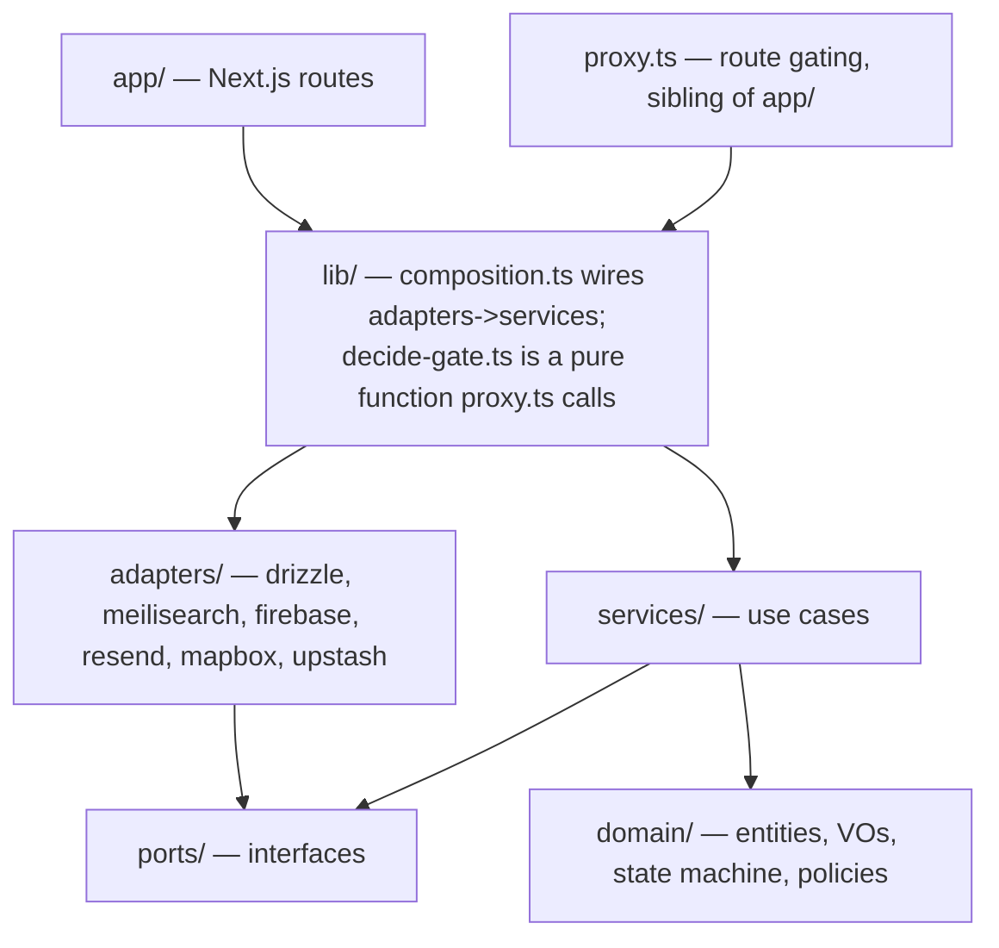
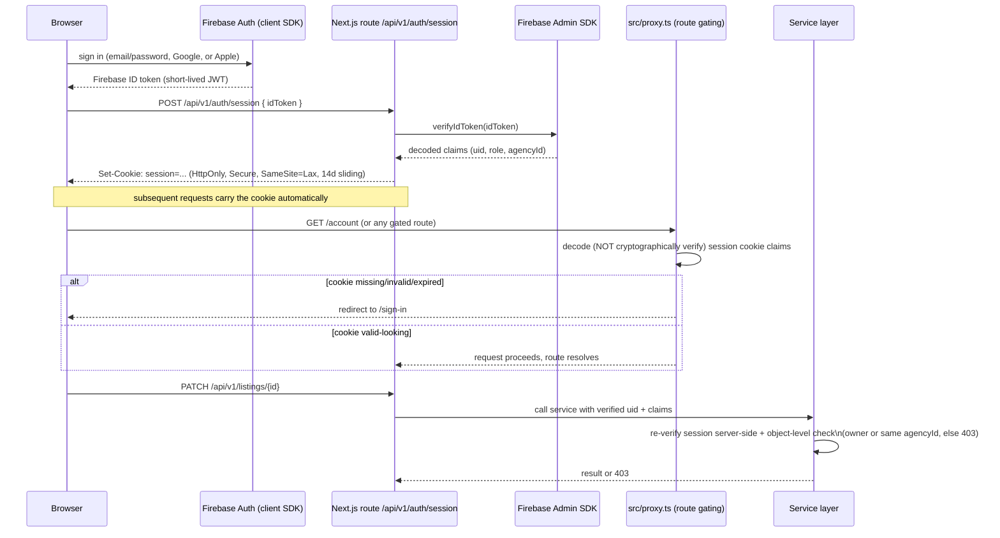
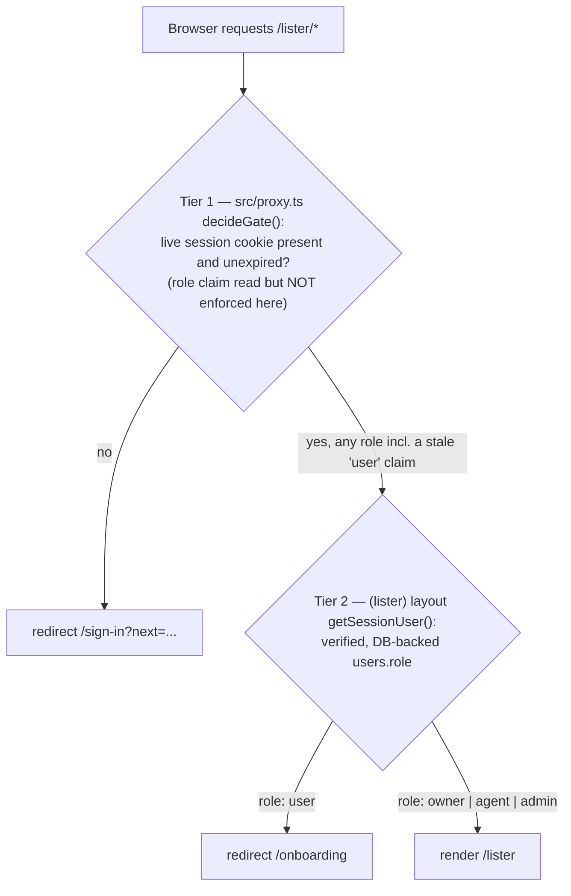

# Doorstep — Architecture

Status: living document, canonical as of M2 (Search + filters). Update
it whenever a boundary, port, or infrastructure decision changes; do not let
it drift from the code. Source of requirements: `docs/PRD.md` (referenced by
section below).

---

## 1. System overview

Doorstep is a UK property marketplace: Next.js 16 (App Router, TypeScript) on
Vercel, Neon Postgres + PostGIS as the single source of truth, Meilisearch as
a disposable search projection, Firebase for Auth and Storage, and a small
set of UK-appropriate integrations (Mapbox, postcodes.io, Resend, Upstash
Redis, Cloudflare Turnstile). PRD §8.1 is the canonical stack table; this
document explains _why the code is organised the way it is_ and _how the
pieces talk to each other_.

The system diagram below adapts PRD §8.2 with M0–M2 status: email and
rate-limiting still exist only as ports with placeholder scaffolds; image
storage, geocoding (both the postcode fast path and free-text place
search) and search (Meilisearch, the outbox drain and nightly reindex
crons) are real as of M1/M2 — see §8 "What M0 deliberately stubs" for the
capability-by-capability table.

```mermaid
flowchart LR
  subgraph Clients
    W[Next.js web app]
    F[Flutter app, phase 2 — not built yet]
  end
  subgraph Vercel[Vercel — region lhr1]
    N[Next.js App Router\nRSC pages + /api/v1 route handlers\nsrc/proxy.ts for route gating]
    C[Cron jobs\noutbox drain (every minute) + nightly reindex (03:00) — real as of M2\nretention, sitemaps — not built yet, land M4-M6]
  end
  subgraph Data
    P[(Neon Postgres + PostGIS\nsource of truth, eu-west-2)]
    M[(Meilisearch\nsearch + geo index — real projection as of M2)]
    R2[(Upstash Redis\nrate limits — stub adapter, lands M4)]
  end
  subgraph Firebase[Firebase — europe-west2]
    A[Auth]
    S[Storage\nlisting images — real adapter as of M1]
  end
  MB[Mapbox Geocoding — real when MAPBOX_ACCESS_TOKEN set, else\npostcodes.io Places fallback, ADR-0007; Mapbox GL map view lands M3]
  PIO[postcodes.io — real adapter as of M1 postcode fast path,\nM2 free-text place-search fallback]
  RE[Resend email — stub adapter, lands M4]
  SEN[Sentry]

  W --> N
  F -.phase 2.-> N
  W --> A
  N --> A
  N --> P
  N --> M
  N -.stub.-> R2
  N --> S
  N -.stub.-> RE
  N --> PIO
  N -.when token set.-> MB
  N --> SEN
  C --> P
  C --> M
```

M0 did not stand up Mapbox, postcodes.io, Stripe or Turnstile integrations;
M1 wired postcodes.io for the postcode fast path (§12) and Firebase Storage
for the image pipeline (§11); M2 wired Meilisearch, the outbox drain and
nightly reindex crons (§13–§15), the public search API (§16) and free-text
place search plus its 30-day cache (§17). Stripe and Turnstile still land
in M4–M6 alongside the features that need them (PRD §13).

---

## 2. Monorepo layout

pnpm workspace, single deployable app in M0 (`apps/web`); the workspace shape
exists from day one so a future `apps/admin-jobs` or a Flutter-adjacent
`packages/api-types` package (phase 2, PRD §16) does not require a restructure.

```
doorstep/
  apps/
    web/
      src/
        app/            Next.js routes only — see §3
        proxy.ts        Route gating for /account, /lister, /admin — a
                         sibling of app/, not a route inside it. Next.js 16
                         renamed the middleware.ts convention to proxy.ts;
                         see §4.
        domain/         entities, value objects, state machine, policies
        services/       use cases orchestrating ports
        ports/          interfaces the domain/services depend on
        adapters/       concrete implementations of ports, incl.
                         adapters/drizzle/ (schema.ts + migrations/ live
                         here, not in a top-level drizzle/ directory)
        components/     ui/ primitives + feature components
        lib/            composition root (lib/composition.ts), route-gating
                         decision logic (lib/decide-gate.ts), config, shared
                         Zod schemas
      tests/
        unit/           domain + services + filter builders, in-memory fakes
        integration/    adapters against real containers (Postgres/PostGIS)
        e2e/            Playwright, critical journeys (PRD §8.8)
      scripts/          seed.ts, seed-data.ts, assert-seed-count.ts — the
                         PRD's M0 "seed script" exit criterion
      drizzle.config.ts drizzle-kit config; points at src/adapters/drizzle/
  packages/             no packages exist yet — pnpm-workspace.yaml reserves
                         the `packages/*` glob for a future shared types
                         package (phase 2 Flutter, PRD §16)
  pnpm-workspace.yaml
  .github/workflows/    ci.yml — jobs: typecheck, lint, unit, integration,
                         build, e2e
```

This is a direct implementation of PRD §8.5's `src/` layout, wrapped in a
pnpm workspace so CI, linting and future packages have a natural home without
touching `apps/web` internals.

---

## 3. The dependency rule

Dependencies point one way: inward, toward the domain. Nothing in
`domain/` or `services/` is allowed to import a framework, a database
client, or an HTTP concern.



Rules, concretely:

- **`domain/`** — pure TypeScript. Entities (Property, Enquiry, Agency,
  User), value objects (Money, GeoPoint), the listing state
  machine (PRD §9.3), and moderation/authorisation policy objects. Zero
  imports from Next.js, Drizzle, Firebase, or any adapter package. Fully
  unit-testable without a database.
- **`services/`** — use cases: `EstablishSession`, `TerminateSession`,
  `GetCurrentUser` landed in M0; `BecomeOwner`, `CreateAgency`,
  `CreateListingDraft`, `UpdateListing`, `SubmitListing`,
  `ChangeListingStatus`, `DeleteListing`, `RequestImageUpload`,
  `ProcessImage` and friends landed in M1 (§9–§11); `PublishListing`
  (admin-side), `SubmitEnquiry`, `ApproveListing` follow in later
  milestones. Each service takes its dependencies as **port** interfaces
  via constructor injection. Services orchestrate; they contain no SQL, no
  HTTP, no Firebase SDK calls.
- **`ports/`** — interfaces only, one file per port:
  `ListingReader`/`ListingWriter` (an ISP split of `ListingRepository`),
  `PropertyImageReader`/`PropertyImageWriter` (the same ISP split applied to
  images), `UserRepository`, `AgencyRepository`, `SearchIndex`,
  `OutboxRepository`, `GeocodeCache`, `ImageStorage`, `Mailer`, `Geocoder`
  (split into `PostcodeGeocoder`/`PlaceSearcher`, an ISP split mirroring
  `ListingReader`/`ListingWriter`), `RateLimiter`, `Clock`, `AuthGateway`.
  Owned by the domain/services side of the boundary — adapters depend on
  ports, not the other way round (DIP). The `outbox` domain entity
  (`domain/outbox.ts`) and the Drizzle table exist since M0; as of M1,
  `ListingWriter` (implemented by `DrizzleListingRepository`, not the
  outbox port itself) writes real rows to it on every visibility-relevant
  mutation (§10); as of M2, `OutboxRepository`
  (`ports/outbox-repository.ts`, implemented by `DrizzleOutboxRepository`)
  is the port the drain worker reads through — see §14 (ADR-0005).
- **`adapters/`** — one folder per external system (`drizzle/`,
  `meilisearch/`, `firebase/`, `postcodesio/`, `resend/`, `mapbox/`, plus
  `upstash/` and the standalone `system-clock.ts`). Each adapter implements
  one or more ports and translates between the vendor's SDK/wire format and
  domain types. Adapters may freely import vendor SDKs; nothing outside
  `adapters/` and `lib/composition.ts` may import a vendor SDK directly. As
  of M2, `adapters/drizzle` (users, agencies, listings, property images,
  outbox), `adapters/firebase` (Auth and Storage), `adapters/postcodesio`
  (UK postcodes plus, as of M2, free-text place search — §12, §17),
  `adapters/meilisearch` (the search index — §13) and `adapters/mapbox`
  (free-text place search, wired instead of postcodesio's fallback
  whenever `MAPBOX_ACCESS_TOKEN` is set — ADR-0007, §17) all have real
  implementations; `resend/` and `upstash/` remain empty scaffolds
  (`export {}`) — see §8.
- **`app/`** — Next.js route handlers and RSC pages only. A route handler
  parses/validates the request (Zod), resolves a service from the
  composition root, calls it, and maps the result to a response. No
  business logic lives here (PRD §8.5 SRP point).
- **`lib/composition.ts`** — the single place where adapters are
  constructed and wired into services (`createServices()`). Test code
  substitutes in-memory fakes here instead of real adapters — this is what
  makes the TDD loop in PRD §8.8 possible without hitting Postgres or
  Firebase for domain/service tests.

### Enforcement

The dependency rule is enforced by ESLint's `no-restricted-imports` rule,
configured per directory in `apps/web/eslint.config.mjs` — not a dedicated
boundaries plugin, and not left to code-review discipline alone:

- `src/domain/**` and `src/services/**`: one rule block bans imports
  matching `next`/`next/*`, `react`/`react-dom` (and their subpaths),
  `drizzle-orm`/`drizzle-orm/*`, `firebase`/`firebase-admin` (and their
  subpaths), and `@/adapters/*`/`**/adapters/**`.
- `src/app/**`: a second rule block bans `@/adapters/*`/`**/adapters/**`
  imports, forcing routes through `@/lib/composition`'s `createServices()`.
- There is currently no lint rule restricting what `adapters/**` itself may
  import — by convention adapters import vendor SDKs freely and import from
  `ports/`/`domain/` to translate types, but unlike the two rules above,
  this is not mechanically enforced today.

A CI lint failure on a boundary violation blocks merge — the `lint` job in
`.github/workflows/ci.yml` runs `pnpm lint` on every PR (PRD §8.8 quality
gates) — this is the mechanical guarantee behind the SOLID rationale in PRD
§8.5, not just documentation.

---

## 4. Auth flow (PRD §7.4, §8.4)

Firebase Auth issues identity; Doorstep issues its own server-side session.
The web app never sends a Firebase ID token on every request — it exchanges
it once for an HTTP-only cookie.

Next.js 16 renamed the `middleware.ts` file convention to `proxy.ts` (same
request-intercepting mechanism, new filename and export name). Doorstep's
route gating lives at `apps/web/src/proxy.ts`; the sequence diagram below
labels that participant `src/proxy.ts` rather than the generic "middleware"
term PRD §8.4 uses, to keep this document traceable to the actual file.



Key properties, traceable to PRD §7.4 and §8.4:

- **Two-tier trust**: `src/proxy.ts` performs cheap route-gating (is there a
  session cookie at all — redirect anonymous users away from `/account`,
  `/list`, `/admin`). It deliberately does **not** cryptographically verify
  the cookie's signature (see the doc comment on `src/lib/decide-gate.ts`)
  — it only decodes the claims to make a fast UX decision, since it runs on
  every matched navigation including prefetches. The **service layer
  performs the real authorisation** — object-level checks (owner or same
  `agencyId`, admin role) on every mutation, via
  `AuthGateway.verifySessionCookie` and `services/authz/policies.ts`.
  `src/proxy.ts` is a UX convenience, never the security boundary.
- **Cookie shape**: HTTP-only, Secure, `SameSite=Lax`, 14-day expiry,
  sliding (refreshed on activity — see `src/lib/session.ts`). Chosen over
  sending the raw Firebase ID token per-request because ID tokens are
  short-lived (~1h) and would either force silent client-side refresh
  plumbing or leak into every request/log; a server session cookie
  centralises verification and revocation.
- **Roles as custom claims**: `{ role: 'user' | 'owner' | 'agent' | 'admin', agencyId?: string }`,
  mirrored from the `users.role` / `users.agency_id` columns (PRD §9.2).
  Role upgrades (private owner → nothing to do; user → agent joining an
  agency) are server-driven; claims refresh on next token refresh, forced
  immediately after an upgrade so the new role is usable without a manual
  re-login.
- **The full authorisation matrix** (guest/user/owner/agent/admin ×
  capability) is PRD §8.4's table; M0 only needs to prove the mechanics —
  sign up, sign in, sign out, and a session that round-trips role claims —
  not the full matrix, which is exercised as each milestone adds the
  capabilities it gates.

---

## 5. Data layer

Full schema is PRD §9; this section covers the architectural decisions that
recur across every table.

- **Primary keys are UUID v7.** Time-ordered (unlike v4), so B-tree
  indexes on `id` and any `id`-derived pagination stay well-behaved, while
  still being safe to expose in URLs/APIs without leaking sequential
  counts (unlike serial ints). See ADR-0004.
- **Money is stored as integer pounds/pcm, never floats.** Sale prices
  are whole pounds; rents are whole pounds-per-calendar-month. No currency
  subunit table is needed because the product is UK-only and GBP-only in
  MVP (PRD §9). See ADR-0004.
- **Status fields carry lifecycle; no soft-delete boolean.** `properties.status`
  is an enum driving a domain state machine (`draft → pending_review →
published → under_offer → completed → archived`, with `rejected` and
  `hidden` branches, implemented in `src/domain/property-status-machine.ts`)
  — PRD §9.3. Invalid transitions are rejected in one place (`domain/`),
  unit-tested exhaustively, so no call site can put a listing into an
  impossible state.
- **Transactional outbox for search sync.** Every visibility-relevant
  mutation writes an `outbox` row in the _same_ Postgres transaction as
  the mutation (PRD §8.6, §9.2). This guarantees the projection to
  Meilisearch is eventually consistent with Postgres even if the process
  crashes mid-mutation — there is no window where a listing is published
  in Postgres but the outbox write was skipped. See ADR-0005. As of M1,
  `ListingWriter.transitionWithOutbox` and `.updateWithSideEffects`
  (`src/adapters/drizzle/repositories/listing-repository.ts`) write real
  `outbox` rows for real status transitions and published-listing edits
  (§10) — this is no longer a not-yet-built path. As of M2, the table is
  drained for real too: `DrizzleOutboxRepository`
  (`src/adapters/drizzle/repositories/outbox-repository.ts`) claims
  unprocessed rows and `GET /api/cron/outbox-drain` runs every minute via
  a `crons` entry in `apps/web/vercel.json` — see §14 for the full
  concurrency and cadence story.
- **PostGIS for location.** `properties.location` is
  `geography(Point, 4326)` with a GIST index, enabling efficient
  radius/bbox queries directly in Postgres as a fallback/reconciliation
  path even though the hot query path for search is Meilisearch's
  `_geoRadius`/`_geoBoundingBox` (PRD §8.6). M0 creates the extension
  (`src/adapters/drizzle/migrations/0000_enable_extensions.sql`) and the
  indexed column; no geo query endpoints exist yet.
- **Firebase is the identity source of truth; Postgres mirrors it.**
  `users.firebase_uid` is the join key; `email`, `role`, `agency_id` are
  mirrored into Postgres for query convenience (search users by
  name/email, join listings to listers) and are kept in sync by the
  session-exchange and admin services, not by a separate sync job.

---

## 6. Environments

| Concern      | Choice                                                                   | Why                                                                                                                                   |
| ------------ | ------------------------------------------------------------------------ | ------------------------------------------------------------------------------------------------------------------------------------- |
| Hosting      | Vercel, functions pinned to `lhr1` (London)                              | UK data-residency preference and lowest latency to UK users (PRD §7.5)                                                                |
| Database     | Neon Postgres, `eu-west-2` (AWS London)                                  | Data residency; branch databases per Vercel preview deployment give every PR an isolated schema + seed without shared-state flakiness |
| Auth/Storage | Firebase, `europe-west2` region resources                                | Data residency to match Neon/Vercel                                                                                                   |
| Search       | Meilisearch Cloud, EU region (real projection as of M2 — §13)            | Data residency; not provisioned in this repo's own local/CI environments, which run a local/CI-container daemon instead (§13)         |
| Environments | Separate Firebase projects and Neon databases for dev, preview, and prod | No shared credentials or data between environments; a bug in preview cannot touch prod data (PRD §7.4, §17)                           |

Preview deploys: each PR gets a Vercel preview build wired to a **fresh Neon
branch database** (schema + seed applied via CI), so integration tests and
manual QA against a preview URL never share state with prod or with other
open PRs. This is the mechanism that lets `M0`'s exit criterion — "sign up,
sign in, sign out on prod URL; CI blocks on gates; schema deployed with
PostGIS enabled" (PRD §13) — be verified on real infrastructure rather than
mocked infrastructure.

Secrets live only in Vercel environment variables, scoped per environment;
no `.env` files with real credentials are committed (PRD §7.4). See the root
`README.md`'s Setup section for the manual account-creation steps this
table assumes.

---

## 7. Rendering strategy

Direct from PRD §8.3, restated here because it drives where in `app/`
new routes belong and which are candidates for the composition root's
"anonymous vs authenticated" service resolution:

| Surface                                                    | Strategy                                                                                                                  | Status as of M2                                                                                                                                                                                                                                                                                                                                                          |
| ---------------------------------------------------------- | ------------------------------------------------------------------------------------------------------------------------- | ------------------------------------------------------------------------------------------------------------------------------------------------------------------------------------------------------------------------------------------------------------------------------------------------------------------------------------------------------------------------ |
| Home                                                       | ISR, revalidated daily or on demand                                                                                       | Placeholder shell only                                                                                                                                                                                                                                                                                                                                                   |
| Area landing pages (`/for-sale/{area}`, `/to-rent/{area}`) | ISR, revalidated daily or on demand                                                                                       | Built M2 (§16) — `revalidate = 86400` plus on-demand `revalidatePath` from `lib/listing-revalidation.ts` whenever a listing in that area changes visibility. Reads `searchParams` for filtered visits (`/for-sale/reading?minBeds=2`), which Next.js treats as per-request dynamic — only the _unfiltered_ canonical path is actually served from the ISR cache; see §16 |
| Search results (list and map)                              | Client-driven UI calling `GET /api/v1/search`; shell server-renders with initial results for SEO on crawlable filter URLs | List built M2 (§16): `SearchResultsPage`, URL-state-as-source-of-truth (`lib/search-url.ts`), the results grid re-queries client-side on any filter/sort/page change. Map view is M3                                                                                                                                                                                     |
| Listing detail                                             | ISR, on-demand revalidation on publish/edit/status change                                                                 | Built M2 (§16) — `GET /api/v1/properties/{slug}` (public, published/under_offer only) and `/property/{slug}` (`revalidate = 3600` plus the same on-demand `revalidatePath` as area pages, fired from the status/PATCH mutation routes). Gallery lightbox, floorplan/EPC tabs and similar-properties finalise in M4 per PRD §13                                           |
| Agency pages                                               | ISR, revalidated on agency edits                                                                                          | Not built yet — no public `/agency/{slug}` route exists; M1 only built the _creation_ form (§9), not the public page                                                                                                                                                                                                                                                     |
| Dashboards (lister, admin), account                        | Dynamic server components, no caching, auth-gated                                                                         | M0 delivered the account shell (sign up/in/out); M1 added the full `/lister` dashboard, the create-listing wizard, and `/onboarding` on the same pattern (§9, §10)                                                                                                                                                                                                       |

---

## 8. What M0 deliberately stubs

This table was written at the end of M0; it is kept below (heading text and
anchor unchanged, since `README.md` and `docs/CONTRIBUTING.md` link to it by
section number) and its contents updated in place as each capability moves
from stub to real adapter, rather than duplicated into a second table. Read
it as "what's still stubbed after the milestones completed so far," not as
an M0-only snapshot.

M0's exit criteria (PRD §13) were narrow on purpose: repo, CI gates, cloud
projects, schema + migrations, auth with session cookies and roles, app
shell, seed script. Everything else in the stack was represented as a
**port with a placeholder or minimal adapter**, not omitted from the
architecture — this is what lets each milestone add real behaviour by
writing a new adapter and a composition-root wiring change, never by
restructuring `domain/` or `services/`. M1 filled in image storage and the
postcode half of geocoding; M2 has since filled in search, the outbox
drain worker, and the remaining (free-text place search) half of
geocoding — four of the six rows below are now real.

| Capability                     | Port exists?                       | Adapter today                                                                                                                                                                                                                                                                                                        | Real adapter lands                                           |
| ------------------------------ | ---------------------------------- | -------------------------------------------------------------------------------------------------------------------------------------------------------------------------------------------------------------------------------------------------------------------------------------------------------------------- | ------------------------------------------------------------ |
| Search (`SearchIndex`)         | Yes                                | **Real as of M2** — `adapters/meilisearch/` (index settings, upsert/delete, geo/filter/sort translation, facets). See §13                                                                                                                                                                                            | Done (M2)                                                    |
| Image storage (`ImageStorage`) | Yes                                | **Real as of M1** — `adapters/firebase/firebase-storage-adapter.ts` (signed uploads, variant writes, download-token public URLs). See §11                                                                                                                                                                            | Done (M1)                                                    |
| Email (`Mailer`)               | Yes                                | `adapters/resend/` is an empty scaffold (`export {}`)                                                                                                                                                                                                                                                                | M4 (enquiry emails), earlier if auth emails need it          |
| Rate limiting (`RateLimiter`)  | Yes                                | `adapters/upstash/` is an empty scaffold (`export {}`)                                                                                                                                                                                                                                                               | M4 (enquiries), tightened per PRD §7.4 limits                |
| Geocoding (`Geocoder`)         | Yes                                | **Real as of M2** — `adapters/postcodesio/` resolves full/partial UK postcodes (§12) and, as the _default_ free-text place-search provider, its own keyless Places API; `adapters/mapbox/` is a real, unit-tested `Geocoder` implementation too, wired instead whenever `MAPBOX_ACCESS_TOKEN` is set (ADR-0007, §17) | Done (M1 postcode fast path; M2 place search, both branches) |
| Outbox drain worker            | Yes (`OutboxRepository`, added M2) | **Real as of M2** — `DrizzleOutboxRepository` (`SELECT ... FOR UPDATE SKIP LOCKED` + lease), `DrainOutbox` use case, `GET /api/cron/outbox-drain` on a `* * * * *` Vercel Cron entry in `apps/web/vercel.json`. See §14                                                                                              | Done (M2)                                                    |

Explicitly, M0 did **not** build: the listing wizard, image pipeline, search
API, map view, enquiries, or admin queue. M1 built the first two of those
(§9–§12 below); M2 built the search API, results UI, area pages and public
detail (§13–§17); map, enquiries and admin remain M3–M5 (PRD §13).
M0's job was the foundation those milestones build on: a correctly-bounded
codebase, a working auth round-trip against real infrastructure, and a
schema that already has the shape (including PostGIS, the outbox, and
Stripe-reserved tables per PRD §9.2) that later milestones need without a
disruptive migration.

---

## 9. Lister onboarding and the two-tier role gate (M1)

PRD §6.5 LST-1. A signed-up `user` becomes a lister one of two ways, both
behind `POST /api/v1/onboarding/*` and both re-verifying the session cookie
server-side rather than trusting any client-supplied role:

- **`POST /api/v1/onboarding/owner`** (`services/listers/become-owner.ts`) —
  instant: a plain `user` (only) becomes `owner`. No new row; `agencyId`
  stays null.
- **`POST /api/v1/onboarding/agency`** (`services/listers/create-agency.ts`)
  — a `user` or an existing `owner` creates an `agencies` row (`verified:
false`, deduplicated slug with a single-retry race guard) and becomes
  `agent` on it. Joining an _existing_ agency (the PRD's "requests to join,
  approved by the agency creator" path) is explicitly out of scope for M1.

Both services call `AuthGateway.setRoleClaims` so _future_ session mints
carry the new role — but the caller's own already-active session cookie
keeps its stale `role: user` claim until the client completes a claims
refresh (`lib/firebase-client.ts`'s `refreshSessionAfterUpgrade`), which
requires a live Firebase Auth user only available in the same tab,
immediately after the onboarding call. This is exactly why role claims in
the session cookie are a UX signal, never an authorisation source (§4): a
route or layout that trusted the claim would bounce a freshly-upgraded
owner back to sign-in on every single upgrade.

That staleness is why `/lister` and `/onboarding` use **two gate tiers**
instead of one, both implemented as of M1 (`src/lib/decide-gate.ts`,
`src/app/(lister)/layout.tsx`):



- **Tier 1 (`src/proxy.ts`, edge-of-request, every matched navigation
  including prefetches):** session presence only for `/lister` and
  `/onboarding` — deliberately _not_ role-gated, unlike `/admin`, which
  keeps the stricter claims check because an admin claim is never granted
  as the immediate next step after the user's own in-session action, so
  there is no equivalent staleness window to protect against.
- **Tier 2, `/lister`** (`(lister)` layout, `src/app/(lister)/layout.tsx`,
  diagrammed above): the real owner/agent/admin check, against
  `getSessionUser()`'s verified, DB-backed `users.role` — a plain `user`
  reaching this far (stale claim or otherwise) is redirected to
  `/onboarding`, never shown a bare 401/404.
- **Tier 2, `/onboarding`** (`src/app/(account)/onboarding/page.tsx`, not a
  layout — `/onboarding` sits in the `(account)` route group, which has no
  role-checking layout of its own): the mirror-image check, inline in the
  page component — `role !== 'user'` (already onboarded, stale claim or
  not) redirects straight to `/lister`, since there's nothing left to
  choose; `role === 'user'` renders the role-choice screen.

Nothing here is the actual authorisation boundary either: every mutating
service (`BecomeOwner`, `CreateAgency`, and every `services/listings/*` /
`services/images/*` use case) re-derives its own decision from the actor
object `GetCurrentUser` resolved from the verified cookie — `requireRole`
for role-gated actions, `canManageListing` for object-level listing/image
mutations (own listing, or same-`agencyId` agent, or admin;
`services/authz/policies.ts`). Both gate tiers above exist purely so an
unauthenticated or wrong-role browser sees a sensible redirect instead of a
page shell that then fails on every request it makes.

---

## 10. Listing lifecycle (M1)

PRD §6.5 LST-2, LST-4, LST-5, §9.3. The state machine itself
(`src/domain/property-status-machine.ts`) was scaffolded in M0 (§5); M1
built the five services that actually drive listings through it, all
behind `services/listings/*`, all object-level authorised via
`canManageListing`, all rejecting a suspended actor
(`AccountSuspendedError`) before anything else:

| Service               | Route                               | What it does                                                                                                                                                                                                                                                                                                                                                                                                                                                                                                                                                                                                                                              |
| --------------------- | ----------------------------------- | --------------------------------------------------------------------------------------------------------------------------------------------------------------------------------------------------------------------------------------------------------------------------------------------------------------------------------------------------------------------------------------------------------------------------------------------------------------------------------------------------------------------------------------------------------------------------------------------------------------------------------------------------------- |
| `CreateListingDraft`  | `POST /api/v1/listings`             | Owner/agent only. Inserts a `draft` row; agent drafts are stamped with `agencyId`, owner drafts stay private. `title`/`slug` are always derived server-side (`domain/listing-copy.ts`), never client input. Every field the loose step-1 draft schema doesn't supply gets a neutral default (`0`/`''`/`null`) so a step-1-only draft still satisfies the schema's `NOT NULL` columns                                                                                                                                                                                                                                                                      |
| `UpdateListing`       | `PATCH /api/v1/listings/{id}`       | Editable statuses: `draft`, `rejected`, `pending_review`, `published` — `under_offer` is deliberately excluded (mid-transaction, not assumed editable like `published`). `channel` is immutable after creation. Edits to a `published` listing use `ListingWriter.updateWithSideEffects` to atomically write an outbox `upsert` row and, only when `price` actually changes, a `listing_price_changed` `events` row (PRD §6.5 LST-4's "price changes are tracked... from day one"). Every other editable status uses plain `update` — nothing about a draft/rejected/pending_review listing is publicly visible, so there's no side effect to make atomic |
| `SubmitListing`       | `POST /api/v1/listings/{id}/submit` | `draft`/`rejected` → `pending_review`. Two completeness gates: the _stored_ listing must satisfy `lib/validation/listing.ts`'s `submitListingSchema` (channel-conditional — tenure for sale, EPC rating for rent), and the listing must have at least `PHOTO_MINIMUM` (1) image uploaded. `pending_review` is never publicly visible (only `published`/`under_offer` are indexed), so this transition writes **no** outbox row                                                                                                                                                                                                                            |
| `ChangeListingStatus` | `POST /api/v1/listings/{id}/status` | The six one-click actions (`sold_stc`, `let_agreed`, `complete`, `hide`, `unhide`, `back_on_market`). Two checks stack: `assertTransition` (is this structurally legal in the domain machine at all?), then a `LISTER_TRANSITIONS` allow-list that blocks the edges that ARE domain-legal but belong to the M5 admin-approval flow — chiefly `pending_review → published`, reachable only because `unhide`/`back_on_market` both target `published`. Every reachable transition writes an outbox row: `upsert` if the target status is publicly visible, `delete` if it isn't                                                                             |
| `DeleteListing`       | `DELETE /api/v1/listings/{id}`      | **Not in the PRD's original API surface table (PRD §10) or PRD §6.5** — a documented M1 contract addition for the dashboard's "delete a draft" action (M1-DESIGN-SPEC.md §4.3/§4.4), following the same lookup-then-authz-then-business-rule shape as the other four. Restricted to `status === 'draft'`. `property_images` rows cascade-delete at the schema level; the underlying Storage objects (original + variants) are **not** cleaned up — a documented gap, not an oversight (see the service's doc comment)                                                                                                                                     |

`GetListing` (`GET /api/v1/listings/{id}`) and `ListMyListings` (a lister's
own/agency's listings, cursor-paginated) round out the group as plain reads,
no side effects.

**Outbox reality check (ties back to §5 and §8):** M1's status/edit paths
write real `outbox` rows through `ListingWriter.transitionWithOutbox` and
`.updateWithSideEffects`
(`src/adapters/drizzle/repositories/listing-repository.ts`), inside the
same Postgres transaction as the `properties` row change — the durability
guarantee ADR-0005 designed for is live. As of M2, the table is drained
for real too (§14): a listing that reaches `published` is searchable via
`GET /api/v1/search` within the drain cron's one-minute cadence, closing
the loop this section originally left open.

---

## 11. Image pipeline (M1)

PRD §6.5 LST-3, §8.7. Three-call flow, all behind `services/images/*`, all
object-level authorised via `canManageListing`:

1. **`RequestImageUpload`** — `POST /api/v1/listings/{id}/images`. Rejects
   once a listing already has `MAX_IMAGES_PER_LISTING` (25) images. Mints
   the image's id (`uuidv7()`, time-ordered like every other row in this
   schema) _before_ any `property_images` row exists, so the same id can be
   embedded in the signed path now and become the row's id once processing
   succeeds. Asks `ImageStorage.createSignedUploadUrl` for a V4 signed PUT
   URL (`adapters/firebase/firebase-storage-adapter.ts`), content-type and
   `MAX_IMAGE_BYTES` (15 MB) bound into the signature via GCS's
   `X-Goog-Content-Length-Range` extension header — enforced by GCS itself
   against the actual bytes uploaded, independent of whatever size the
   client claims in the request body. Valid for 15 minutes. Writes nothing;
   nothing exists at the path until the client's PUT lands.
2. **Client PUTs the file's bytes directly to the signed URL** — never
   through the Next.js server (PRD §7.4: "uploads go directly to storage").
3. **`ProcessImage`** — `POST /api/v1/listings/{id}/images/{imageId}/process`,
   called by the client immediately after the PUT completes. The **only**
   place a `property_images` row is created — there is no "pending upload"
   status. Pipeline, entirely via `sharp`:
   - Reads the original back from `ImageStorage.get`; a `null` result means
     the PUT never landed (`OriginalImageNotFoundError`).
   - `.rotate().toBuffer({resolveWithObject: true})` bakes EXIF orientation
     into the pixels and returns corrected width/height — sharp's re-encode
     strips all other metadata (EXIF, GPS, ICC aside from sRGB) as a side
     effect, satisfying PRD §7.4's "EXIF stripped on processing" with no
     extra step.
   - Computes a blurhash (`domain/blurhash.ts`) over a raw RGBA decode of a
     32px-max thumbnail.
   - `domain/image-variant-plan.ts`'s `planImageVariants` decides which
     (width, format) pairs to render from the corrected width — 400/800/
     1600px in WebP and AVIF, never upscaling past the original's own
     width. Each variant is written to `ImageStorage.put` under
     `domain/image-storage-path.ts`'s `variantImagePath` convention
     (`listings/{propertyId}/variants/{imageId}/{width}.{format}`).
   - Inserts the `property_images` row (`kind: 'photo'`, `position` = the
     current image count for this listing — a documented small race window
     on concurrent uploads, not closed for M1: a duplicate position is a
     display-order glitch fixable by drag-reorder, not a data-integrity
     problem).
   - Returns the row via `attachImageUrls`, which re-derives every
     variant's public URL rather than storing them — `PropertyImageEntity`
     only ever persists `storagePath` (the private original), so without
     this the wizard's photo grid would have nothing to point an `` at.
4. **`ReorderImages`, `SetImageKind`, `DeleteImage`, `ListListingImages`,
   `GetCoverBlurhashes`** round out the pipeline: `PATCH
/api/v1/listings/{id}/images/{imageId}` for position/kind, `DELETE` for
   removal (deletes the DB row first, then best-effort deletes the original
   plus every variant path — recomputed from the stored width via the same
   deterministic `planImageVariants`, not persisted — via
   `Promise.allSettled` so a storage failure doesn't fail the request), and
   `GET .../images` for the wizard reloading a resumed draft's already-
   processed photos.

**Public URLs are Firebase download tokens, not signed URLs — see
ADR-0006** for the full reasoning (long-cache immutability vs. GCS's 7-day
V4 signature cap) and how the `ImageStorage` port keeps a future Cloudinary
swap to an adapter change plus a URL migration script, per PRD §8.7 point 4.
Originals are never served publicly — only `variants/` paths are ever
passed to `ImageStorage.publicUrl`.

Contract tests (PRD §8.7's exit criterion) run against two backends from
one shared suite (`tests/integration/image-storage.contract.ts`): an
always-on `InMemoryImageStorage` fake, and `FirebaseStorageAdapter` against
a real bucket when `TEST_FIREBASE_STORAGE_BUCKET` is set (local-only, since
CI has no such secret) — see the root `README.md`'s Testing section.

---

## 12. Geocoding: the postcode fast path (M1)

PRD §8.6, §10. `adapters/postcodesio/`'s `geocode` method (`PostcodeGeocoder`)
was the one half of `Geocoder` wired in M1's composition root, behind
`SearchGeocode` (`GET /api/v1/geocode?q=`, public — no session required).
Free, open, no API key, GB-only, which was exactly M1's scope: the wizard's
address step (M1-DESIGN-SPEC.md §3.2), not the general-purpose free-text
place search PRD §8.6 describes for search — that half (`PlaceSearcher`,
Mapbox-when-configured else this same adapter's own Places API) landed in
M2; see §17.

Recognition is regex-based against the UK postcode grammar, entirely local
(no network call for input that can't possibly match):

- A **full postcode** (`RG30 1AA`, unspaced/lower-case accepted) resolves
  via `GET postcodes.io/postcodes/{postcode}`.
- A **partial postcode / outcode alone** (`RG30`) resolves via
  `GET postcodes.io/outcodes/{outcode}` to that outcode's centroid — PRD
  §8.6's "includes outcode centroids for partial postcodes."
- Anything matching neither shape returns `null` **without calling
  postcodes.io at all** — free-text place queries ("Reading town centre")
  are an expected case here, not a client error; as of M2,
  `SearchGeocode` (§17) falls through to `PlaceSearcher` on that `null`
  rather than returning an empty result — this section's M1 scope was
  the postcode half only, the half that still stands unchanged today.

`label` prefers `admin_district`, falling back to `parish`, then the
outcode itself — "good enough for a confirmation line" (the wizard shows
"Found: Reading, RG1"), not an authoritative boundary lookup.

---

## 13. Search projection and sync (M2)

PRD §8.6, ADR-0003. `ports/search-index.ts`'s `SearchIndex` is implemented
for real by `adapters/meilisearch/`'s `MeilisearchSearchIndex` — a thin
translation layer over the official `meilisearch` npm client; nothing
outside that one file imports the vendor SDK directly (DIP, same shape as
`adapters/firebase/firebase-storage-adapter.ts`).

**Document shape v2.** `ListingSearchDocument` is the PRD §8.6 shape
(`id, channel, title, displayAddress, town, outcode, propertyType,
bedrooms, bathrooms, price, priceQualifier, tenure, furnished,
availableFrom, newHome, features, coverImageUrl, imageCount, agency {id,
name, logoUrl}, publishedAt, _geo {lat, lng}`) plus two fields the PRD's
own list omits: `slug` and `status`. Neither is filterable or sortable —
both exist purely so `services/search/search-listings.ts`'s public DTO
mapper can build a listing-detail link and badge a Sold STC/Let Agreed
card straight from a search hit, with zero per-hit Postgres lookup.
`status` is always `'published'` or `'under_offer'` in practice — the same
`INDEXABLE_STATUSES` guard `services/search/map-listing-to-search-
document.ts` enforces (raising `NotIndexableListingError` for anything
else) — it is typed as the full `PropertyStatus` union only because that
is what `Listing.status` already carries, not because every value is
expected to appear. The document is never persisted anywhere itself:
`mapListingToSearchDocument` rebuilds it fresh from a `Listing` (+ its
images + agency) every time something needs (re)indexing, the same
"pure re-derivation, not a stored list" choice `services/images/
attach-image-urls.ts` makes for image variant URLs.

**Settings.** `ensureSettings()` applies PRD §8.6's exact configuration —
filterable (`channel, price, bedrooms, bathrooms, propertyType, tenure,
furnished, newHome, town, outcode, _geo, availableFrom`), sortable
(`price, publishedAt`), searchable (`title, displayAddress, town,
outcode`) — and requests facet counts on `propertyType`, `furnished`,
`tenure`, `bedrooms` on every `search()` call. It is idempotent (safe to
call repeatedly) but is **not** called automatically on every deploy or
request: today it only runs as part of `RebuildSearchIndex` (§15) and
`scripts/seed-search-5k.ts` — a brand-new Meilisearch instance needs one
reindex run before it has settings applied at all, which is exactly why
"what prod needs" in the root `README.md`'s Search section calls for
triggering `/api/cron/reindex` once by hand after the first deploy.

**The disposable-index principle (PRD §7.6, §8.6; ADR-0003).** Every write
method (`upsert`, `delete`, `clear`, `ensureSettings`) chains Meilisearch's
own `.waitTask()` before resolving, so by the time an `await` returns, the
change is already searchable — and `assertTaskSucceeded` turns a
`status: 'failed'` task (which `.waitTask()` itself resolves rather than
throws for) into a thrown error, so a caller can never mistake "the write
finished" for "the write succeeded." Nothing about this adapter, or the
services that call it, treats Meilisearch as anything other than a
projection that can be deleted and rebuilt from Postgres at any time —
see §15 for the mechanism that does exactly that nightly, and §16 for how
a request-time failure degrades gracefully rather than taking the rest of
the app down with it.

---

## 14. Outbox drain worker: concurrency and cadence (M2)

PRD §6.5 LST-5 ("search visibility within 1 minute"), §8.6, ADR-0005.
§5/§10 describe the write half (every visibility-relevant mutation writes
an `outbox` row inside the same transaction as the mutation); this section
is the read half M2 adds.

**Claiming, concurrently safe.** `DrizzleOutboxRepository.claimBatch`
(`src/adapters/drizzle/repositories/outbox-repository.ts`) selects
unprocessed rows ordered oldest-first, `FOR UPDATE SKIP LOCKED` — a second
concurrent invocation (a slow-running previous cron tick overlapping the
next one, or two instances during a redeploy) simply skips whatever rows
the first has already locked rather than blocking on them or double-
claiming. Claimed rows are stamped `claimed_at` inside the same
transaction as the `SELECT`. A **5-minute lease**
(`DEFAULT_LEASE_DURATION_MS`) is the recovery path for a claim that never
gets marked processed (a crashed run): `claimBatch` only excludes rows
whose `claimed_at` is within the lease window, so an abandoned claim
becomes claimable again on its own, generously wide relative to both the
one-minute cron cadence and how fast a healthy run actually completes
(seconds, not minutes) — this only ever matters on genuine failure.
Migration `0003_outbox_claimed_at.sql` is what added the column this
scheme depends on.

**Resolution, not replay.** `DrainOutbox.execute()`
(`src/services/search-sync/drain-outbox.ts`) does not trust a claimed
row's `op` at face value. A `delete` op is issued as-is (safe against a
document that may already be gone). An `upsert` op re-loads the listing
from Postgres and re-maps it fresh; if the listing has since become
non-indexable (hidden, completed, deleted) `map-listing-to-search-
document.ts`'s own `NotIndexableListingError` guard redirects that entry
to a delete instead of trusting a possibly-stale "upsert" that was
correct when the row was enqueued but may not be by the time the drain
worker gets to it. When a batch has more than one row for the same
property (published then immediately hidden inside one minute, say),
entries are resolved in claimed order and the **last one wins** — the
same "re-derive from current truth" principle applied per-property rather
than per-row. All resolved upserts go to `SearchIndex.upsert` in one
batched call, all resolved deletes to `SearchIndex.delete` in one more;
`markProcessed` for the whole claimed batch only runs after **both**
succeed — if either throws, nothing in the batch is marked processed and
the lease simply expires for a later run to retry, which is safe because
every op here is idempotent (Meilisearch upsert/delete keyed on `id`).

**Cadence vs the exit criterion.** `apps/web/vercel.json`'s
`/api/cron/outbox-drain` entry runs `"* * * * *"` — every minute — which
is the literal mechanism PRD §13's M2 exit criterion ("publish-to-
searchable under 1 minute") and PRD §6.5 LST-5 ride on: a mutation
committed at T is claimed and applied by the drain run that starts
sometime in `(T, T+60s]`. `GET /api/cron/outbox-drain`
(`src/app/api/cron/outbox-drain/route.ts`) is a `GET` handler, not `POST`
— Vercel Cron Jobs always invoke the configured path with `GET`, so a
`POST`-only handler would 405 on every real trigger. Authorisation is
`CRON_SECRET` (`src/lib/verify-cron-request.ts`), not a session cookie:
Vercel attaches `Authorization: Bearer ${CRON_SECRET}` to its own
scheduled requests automatically once the var is set on the project; both
cron routes 401 every other request while it's unset.

---

## 15. Nightly reindex: clear-then-rebuild (M2)

PRD §7.6, §7.7, §8.6; ADR-0008. `GET /api/cron/reindex`
(`src/app/api/cron/reindex/route.ts`, same `CRON_SECRET`/`GET` shape as
§14) runs on `apps/web/vercel.json`'s `"0 3 * * *"` entry (03:00 UTC
daily) and calls `RebuildSearchIndex`
(`src/services/search-sync/rebuild-search-index.ts`).

**Why clear-then-rebuild, not diff-and-patch.** The alternative — compute
exactly which documents are orphaned in Meilisearch and delete only those
— needs a way to enumerate every id currently in the index, which
`SearchIndex` has no method for (`search()` is query-scoped, not
"list everything"), and inventing one just for a once-a-night job would be
speculative surface this milestone doesn't otherwise need. `clear()` plus
a full re-upsert is simpler, gives an unambiguous end state (exactly what
Postgres says right now, nothing else), and PRD §8.6 itself calls
Meilisearch "a disposable projection" (§13) — the brief window where the
index is emptier than it should be, scheduled for the UK's lowest-traffic
hour, is an accepted trade-off for that simplicity, not an oversight. See
ADR-0008 for the full alternatives-considered writeup.

**Mechanics.** `execute()` reads `ListingReader.countIndexable()` (the
Postgres source-of-truth count) and `SearchIndex.countDocuments()` (the
Meilisearch count _before_ this run) up front, calls `ensureSettings()`
(§13) then `clear()`, then pages through every indexable listing
(`DEFAULT_PAGE_SIZE = 200` per page, per `SearchIndex.upsert` call) via
`ListingReader.listIndexable`, mapping and upserting each page. It then
re-reads `countDocuments()` (the Meilisearch count _after_) and compares
it against the Postgres count captured at the start.

**Drift detection.** A mismatch between `postgresCount` and
`meiliCountAfter` is logged via `console.warn` — this is the detectable-
signal half of PRD §7.7's "alert on outbox backlog > 500" companion
requirement (an index-count mismatch, not backlog size specifically), not
the notification-delivery half: there is no Sentry/alerting integration
wired in this codebase yet to route the warning to a human. `indexed`
(the count actually upserted this run), `drift.postgresCount`,
`drift.meiliCountBefore` and `drift.meiliCountAfter` are all returned in
the route's JSON response, so a manual check against
`GET /api/cron/reindex`'s own response body is the mechanism today, ahead
of a real alert channel landing alongside Sentry.

---

## 16. Search API, results UI and graceful degradation (M2)

PRD §6.1 SRCH-1–4/7, §7.6, §10.

**`GET /api/v1/search`** (`src/app/api/v1/search/route.ts`,
`src/lib/validation/search.ts`). Thin per §3's rule: build a raw
query-param record, `safeParse` against `searchQuerySchema`, call
`SearchListings.execute`, map the result. `channel` is required; geo is
one of three mutually exclusive shapes — a `lat`+`lng` (+ optional
`radiusMiles`, 0.25–30) point-radius search, all four `bboxNe*`/`bboxSw*`
corners together for a bounding-box search (the shape M3's map view will
use — the query path already exists, only the map UI doesn't yet), or
neither for "all GB." Every other filter
(`priceMin`/`Max`, `bedsMin`/`Max`, `bathsMin`, `types` (CSV), `tenure`,
`furnished`, `availableBy`, `newHome`, `town`, `outcode`) is channel-
agnostic at the validation layer on purpose — e.g. `tenure` on a
`channel=rent` request isn't rejected, it just matches nothing, the same
way any Meilisearch filter clause that doesn't apply behaves. `sort`
(`newest` default, `price_asc`, `price_desc`) and `page` (1-based, capped
at 200) round out the schema. `SearchListings`
(`src/services/search/search-listings.ts`) translates the validated
input into `ports/search-index.ts`'s `SearchQuery` shape and maps each
`ListingSearchDocument` hit to a public `PublicSearchHit` DTO — documented
as the contract the Flutter app will reuse in phase 2 (PRD §10).

**`GET /api/v1/geocode?q=`** (`src/app/api/v1/geocode/route.ts`,
`src/services/geocoding/search-geocode.ts`) returns
`{ data: { version: 2, results } }` — the version bump from M1's bare,
undiscriminated `GeocodeResult[]`. `SearchGeocode.execute` checks the
postcode fast path first (`PostcodeGeocoder`, §12); only when that returns
`null` does it fall through to `PlaceSearcher` (§17), and each result
carries a `kind: 'postcode' | 'place'` discriminant. Both paths are
wrapped in a 30-day cache (§17).

**Graceful degradation (PRD §7.6).** `SearchListings` does **not** call
`SearchIndex.healthy()` before every search — that would add a second
Meilisearch round trip to every request, working directly against the
p75 < 500 ms target (PRD §7.1, §13) for zero behavioural gain, since an
unreachable index fails the same way either way. Instead, any error
`SearchIndex.search` itself throws is wrapped in `SearchUnavailableError`
(`src/services/search/errors.ts`); the route maps that to
`503 { error: { code: 'search_unavailable' } }` ahead of the generic 500
fallback. The results UI (`components/features/search/outage-panel.tsx`)
renders `OutagePanel` in the result-grid slot only on that response —
header, filter bar and applied chips stay rendered and interactive, so
retrying is one click, not a page reload; everything Postgres-backed
(detail pages, dashboards) is entirely unaffected, exactly as PRD §7.6
specifies. `healthy()` stays on the `SearchIndex` port for a caller that
_does_ want a proactive check outside the request path (a future admin
status page) — it is simply not `SearchListings`'s job.

**Results UI and URL state.** `src/lib/search-url.ts` is the single
source of truth for what the current search _is_ — components read/write
through it rather than inventing their own param names, and it is
deliberately a **different** vocabulary from `searchQuerySchema`'s API
param names (`minPrice`/`type`/`availableFrom` on the public URL vs.
`priceMin`/`types`/`availableBy` on the API; `buildSearchApiQuery` is the
one translation point). Canonicalisation drops default-valued params
(`sort=newest`, `page=1`) so two URLs meaning the same search converge on
one string (SEO). The filter disclosure popover (M2-DESIGN-SPEC.md §1.6)
is the one new interaction primitive this milestone introduces — not a
modal, no backdrop or focus trap, dismissible by outside-click/Escape,
built once and reused for all four filter triggers. Removable filter
chips render the _resolved_ value ("Min 2 beds," never "beds=2"), stepped
price `<select>` pairs use sale/rent-specific value lists
(`src/lib/search-price-steps.ts`), and result cards load images
blurhash-first (`result-card.tsx`, reusing M1's blurhash helpers).

**Rendering strategy** for the three M2 surfaces is §7's table, restated
briefly here for the on-demand-revalidation mechanism specifically: both
area pages and the detail page call `revalidatePath`
(`src/lib/listing-revalidation.ts`'s `revalidateListingPaths`) from the
status-transition and PATCH-edit routes — never from `services/`, which
stays framework-free (§3's DIP rule) — targeting `/property/{slug}`
always, plus any curated area (`src/lib/areas.ts`) whose `town`/`outcode`
match the listing. The detail page itself reads no `searchParams`, so it
gets uncompromised ISR (`revalidate = 3600`); area pages _do_ read
`searchParams` (to support `/for-sale/reading?minBeds=2`), which Next.js
treats as per-request dynamic — so only the bare canonical area path is
actually ISR-cached, filtered visits to it are freshly rendered every
time, same as the plain search-results route.

---

## 17. Geocoding: free-text place search and the 30-day cache (M2)

PRD §8.6, §10 SRCH-1; ADR-0007. `ports/geocoder.ts` splits `Geocoder` per
ISP into `PostcodeGeocoder` (§12, unchanged from M1) and `PlaceSearcher`
— `searchPlaces(query): Promise<PlaceSuggestion[]>`, free-text,
GB-biased, returning `[]` (never throwing) for "no matches."

**Provider selection (documented PRD deviation).** PRD §8.6 names Mapbox
Geocoding as _the_ free-text provider, with no fallback mentioned.
`src/lib/composition.ts` wires `PlaceSearcher` to `MapboxGeocoder`
(`adapters/mapbox/`) **only when `MAPBOX_ACCESS_TOKEN` is set**; when it
isn't — true for this project's local/CI environments today —
`adapters/postcodesio/`'s own `searchPlaces` (backed by postcodes.io's
free, keyless Places API, itself backed by OS Open Names GB, a separate
dataset from the postcode endpoints §12 uses) serves as the _default_
provider instead. Both adapters are real, complete `Geocoder`
implementations — `MapboxGeocoder` is unit-tested against a mocked fetch
(`tests/unit/adapters/mapbox/`) and exercised for real by
`tests/integration/mapbox-geocoder.test.ts` whenever a token is available
— this is a deliberate, ADR-recorded gap in what's _provisioned_, not
what's _built_. See ADR-0007 for the full reasoning and consequences.

**30-day cache.** `ports/geocode-cache.ts`'s `GeocodeCache` wraps both
halves of `Geocoder` with separate `get`/`set` pairs for postcodes and
places — a postcode miss (`null`) and a places miss (`[]`) are each
meaningful _positive_ results worth caching in their own right, not
"never looked up," which is what a single generic slot would conflate.
`adapters/in-memory-geocode-cache.ts`'s `InMemoryTtlGeocodeCache`
implements the port today as two plain `Map`s with a 30-day TTL
(PRD §8.6), wired at the composition root as a **process-lifetime
singleton** — real caching benefit on a long-lived Node process, a much
weaker one on Vercel's serverless functions specifically (a cold start
gets an empty cache; a scaled-out second instance shares nothing with
this one) — an accepted, documented gap `adapters/upstash/`'s Upstash
Redis backend closes in M4, not a defect in this adapter. The cache key
is the query trimmed and lowercased in `SearchGeocode`
(`services/geocoding/search-geocode.ts`) — `postcodeGeocoder`/
`placeSearcher` themselves always see the caller's original, unmodified
query; normalisation is a caching concern only.

---

## Related documents

- `adr/0001-layered-architecture-with-ports-and-adapters.md`
- `adr/0002-firebase-auth-with-server-session-cookies.md`
- `adr/0003-postgres-postgis-source-of-truth-meilisearch-projection.md`
- `adr/0004-drizzle-orm-uuidv7-integer-money.md`
- `adr/0005-transactional-outbox-for-search-sync.md`
- `adr/0006-firebase-storage-download-tokens.md`
- `adr/0007-postcodesio-places-fallback-for-geocoding.md`
- `adr/0008-clear-then-rebuild-nightly-reindex.md`
- `PRD.md` — product requirements, source of all constraints cited above
