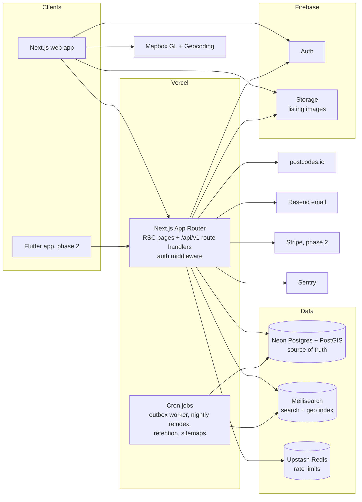
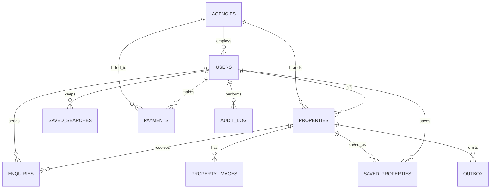
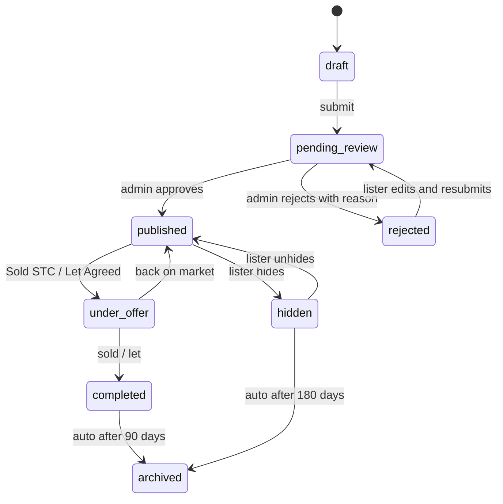

# Doorstep (working title): UK Property Marketplace

## Product Requirements Document

| Field | Value |
| --- | --- |
| Version | 0.1 (draft for review) |
| Author | Anoop Jose, Flutterly Ltd |
| Date | 4 August 2026 |
| Status | Draft |
| Target market | United Kingdom, launching hyperlocal in Reading and the Thames Valley |

**Decisions locked for this draft:** sales *and* lettings in the MVP; web first with a Flutter app as a fast follow in phase 2; Postgres + PostGIS + Meilisearch as the data layer; Firebase Auth and Firebase Storage retained from your existing toolkit.

---

## Table of contents

1. [One-page summary](#1-one-page-summary)
2. [Context, goals and non-goals](#2-context-goals-and-non-goals)
3. [Users and personas](#3-users-and-personas)
4. [Success metrics](#4-success-metrics)
5. [Scope](#5-scope)
6. [User stories and acceptance criteria](#6-user-stories-and-acceptance-criteria)
7. [Non-functional requirements](#7-non-functional-requirements)
8. [Architecture and tech stack](#8-architecture-and-tech-stack)
9. [Data model](#9-data-model)
10. [API surface](#10-api-surface)
11. [Integrations](#11-integrations)
12. [Moderation and content policy](#12-moderation-and-content-policy)
13. [Milestones and delivery plan](#13-milestones-and-delivery-plan)
14. [Running costs](#14-running-costs)
15. [Risks and mitigations](#15-risks-and-mitigations)
16. [Future phases](#16-future-phases)
17. [Launch checklist](#17-launch-checklist)
18. [Open questions](#18-open-questions)

---

## 1. One-page summary

**Doorstep is a UK property marketplace in the spirit of Rightmove.** Estate agents, letting agents and private owners list homes for sale or rent. Buyers and renters search by place name or postcode, filter by price, bedrooms and property type, browse results as a list or on a map, save favourites and searches, and send enquiries directly to the lister. An internal admin team approves every new listing before it goes live, moderates content, manages users and watches a basic analytics dashboard.

**Who it serves:** buyers and renters (demand side), estate and letting agents plus private sellers and landlords (supply side), and the internal admin/ops team.

**MVP in one table:**

| Side | Capabilities |
| --- | --- |
| Buyer / renter | Buy or rent search by place or postcode; filters (price, beds, type, plus furnished and available date for rentals); list and map views; rich property detail pages; favourites; saved searches; enquiry form |
| Seller / agent | Account and agency setup; create listing via a guided wizard (sale or rent); image, floorplan and EPC upload; edit; mark Sold STC / Let Agreed, sold or hidden; enquiry inbox |
| Admin | Approval queue for new listings; content moderation and reported listings; user and agency management; basic analytics; audit log |

**Stack in one line:** Next.js 16 + TypeScript on Vercel, Firebase Auth and Storage, Neon Postgres with PostGIS as the source of truth, Meilisearch for geo search and filtering, Mapbox for maps and geocoding, Resend for email, Stripe reserved for phase 2 monetisation.

**Delivery in one line:** roughly 14 weeks of focused build for one full-time developer (16 with contingency), shipped in 7 milestones, launching as a free hyperlocal beta in Reading with 2 or 3 partner agencies before widening coverage.

**North star metric:** qualified enquiries delivered to listers per week. A marketplace that reliably produces enquiries retains supply, and supply retains demand.

---

## 2. Context, goals and non-goals

### 2.1 Problem

* **Consumers** get a dated, cluttered search experience on incumbent portals, weak filtering for rentals, and little transparency about listing freshness.
* **Agents** pay incumbent portals high and rising membership fees with little pricing flexibility for smaller independent branches.
* **Private sellers and landlords** cannot list on Rightmove or Zoopla at all without going through an intermediary, leaving them with classified-ad sites that lack trust signals.

### 2.2 Why this can win a wedge

Portals are network-effect businesses, so the MVP does not try to beat Rightmove nationally. The wedge is: pick one geography (Reading and the Thames Valley), onboard a handful of independent agencies free of charge, accept vetted private listings that incumbents refuse, and win on freshness, UX quality and local SEO. Expansion follows liquidity, not the other way round.

### 2.3 Product goals (MVP)

1. A buyer or renter can go from landing page to a relevant, filtered result set in under 10 seconds.
2. An agent can publish a complete, photographed listing in under 10 minutes, subject to approval.
3. Every listing is human-approved before publication; median approval time under 24 hours.
4. Every enquiry reaches the lister by email within 1 minute and is visible in their dashboard.
5. The API is clean enough that the phase 2 Flutter app consumes it without rework.

### 2.4 Non-goals for the MVP

No payments or monetisation (free while building liquidity), no CRM/feed ingestion from agent software, no mortgage or conveyancing tools, no instant valuations, no in-app chat, no commercial property, no international coverage, no native mobile apps yet.

---

## 3. Users and personas

**Sarah, 31, first-time buyer (demand).** Searching for a 2-bed under £350k within cycling distance of Reading station. Browses on her phone during commutes. Needs strong filters, a map she trusts, and instant saving so she can shortlist with her partner. Success: she enquires on three homes in her first week.

**Tom, 24, graduate renter (demand).** Needs a furnished 1-bed or flatshare-suitable flat, available from a specific month, under £1,300 pcm. Rental-specific filters (furnished, available from) matter more to him than tenure or EPC. Success: he books two viewings in 48 hours.

**Priya, 43, branch manager at an independent agency (supply).** Manages roughly 40 active sale and rental listings. Has no patience for clunky admin tools. Needs fast listing creation, easy photo management, one-click Sold STC / Let Agreed, and enquiries that reach the right inbox. Success: her branch's listings are live and generating enquiries within the first week of onboarding.

**David, 58, private landlord and occasional seller (supply).** Owns two rental flats and is selling his late mother's house. Priced out of agent fees for the rentals. Needs a guided wizard that tells him exactly what a legal, complete listing requires (including the EPC). Success: his first listing passes moderation on the first attempt.

**The admin/ops team (internal).** Initially Anoop plus part-time help. Needs a queue that makes approval decisions fast and consistent, tools to suspend bad actors, and enough analytics to know whether the marketplace is alive. Success: the approval SLA holds without moderation consuming the week.

---

## 4. Success metrics

North star: **qualified enquiries delivered per week** (an enquiry that passes spam checks and is delivered to an active lister).

| Category | Metric | Target at launch + 90 days |
| --- | --- | --- |
| Supply | Live listings (sale + rent) | 300+ |
| Supply | Verified agencies onboarded | 8+ |
| Supply | Median time from signup to first listing submitted | < 24 hours |
| Demand | Registered users | 2,000+ |
| Demand | Weekly active searchers | 600+ |
| Engagement | Search to detail-page CTR | > 25% |
| Engagement | Detail page to enquiry conversion | > 4% |
| Engagement | Saved properties per active user | > 2 |
| Marketplace | Qualified enquiries per month | 500+ |
| Ops | Listings approved within 24h | 95% |
| Quality | Enquiry spam rate after filtering | < 2% |
| Technical | Search API p75 latency | < 500 ms |
| Technical | LCP on mobile, p75 | < 2.5 s |

Guardrails: moderation SLA and spam rate must not degrade as listing volume grows; if they do, tooling work pre-empts feature work.

---

## 5. Scope

### 5.1 In scope for MVP

Items marked **(added)** were not in the original brief but are required to make the rest work or are cheap and high-value.

**Buyer / renter side**

* Buy / Rent channel toggle across search **(added, follows the sales + lettings decision)**
* Search by place name or full/partial postcode with autocomplete suggestions
* Radius control (this area only, up to 30 miles)
* Filters: price min/max (channel-appropriate steps), bedrooms min/max, property type; rentals add furnished status and available-from date
* Sort: newest, price ascending, price descending
* List view with result cards; map view with clustered pins and search-as-the-map-moves
* Property detail page: photo gallery, floorplan, key facts (price, beds, baths, type, tenure, EPC), description, key features, location map, lister card
* Save/unsave favourites with a favourites page (requires account)
* Saved searches: name and re-run stored filter sets (email alerts are phase 2) 
* Enquiry form on every listing, open to guests and signed-in users **(guest enquiries added to maximise conversion)**
* Sign up / sign in with email + password, Google and Apple via Firebase Auth
* Report-a-listing link on detail pages **(added)**

**Seller / agent side**

* Role onboarding: private owner flow and agent flow with agency creation or join **(added, implied by the brief)**
* Guided create-listing wizard covering sale and rent variants, with save-as-draft
* Image upload with drag-to-reorder, cover selection, floorplan and EPC document types; automatic resize/compression
* Edit listings; first publication requires approval, later edits go live immediately but enter a retro spot-check feed
* Status controls: submit for approval, mark Sold STC / Let Agreed, mark sold/let, hide, back on market
* Enquiry inbox per lister with new / contacted / closed statuses and email notifications
* Public agency profile page listing the agency's live properties **(added, cheap and builds trust)**

**Admin side**

* Approval queue with full listing preview, approve or reject with canned + free-text reasons, decision emails to listers
* Reported listings and edited-listing spot-check queues
* User management: search, view, suspend, reinstate, ban, change role, verify agencies
* Basic analytics dashboard: listings by status and channel, new users, enquiries over time, top search areas
* Audit log of every admin action **(added, accountability and GDPR hygiene)**

**Platform (added, foundational)**

* Transactional email (enquiry notifications and receipts, moderation decisions, welcome)
* SEO foundations: server rendering, sitemaps, structured data, area landing pages
* GDPR essentials: cookie consent, privacy policy, account deletion, data retention jobs
* Rate limiting and anti-spam on enquiries and auth-sensitive routes

### 5.2 Out of scope for MVP

| Item | Why deferred | Phase |
| --- | --- | --- |
| Payments, agent subscriptions, featured listings | Free supply acquisition first; Stripe schema reserved | 2 |
| Saved-search email alerts | Needs digest infrastructure; schema ships in MVP | 2 |
| Flutter mobile app | Web validates the marketplace; API is designed for it | 2 |
| Agency multi-branch and team permissions | Single agency entity is enough for launch partners | 2 |
| CRM / portal feed ingestion (agent software) | The real moat later, heavy spec work | 3 |
| AI search, listing copy generation, image tagging | Needs baseline usage data first | 3 |
| Instant valuations (AVM), sold price history | Requires Land Registry data pipeline | 3 |
| In-app messaging / chat | Email enquiries are the industry norm at this stage | 3 |
| Commercial property, auctions, new-homes developer channel | Different data models and buyers | Later |

---

## 6. User stories and acceptance criteria

Priorities: **P0** = MVP cannot launch without it. **P1** = should ship in MVP, first to cut if the timeline slips. **P2** = stretch.

Acceptance criteria are written to convert directly into tests (unit, integration or Playwright e2e) in line with the TDD approach in section 8.8.

### 6.1 Search and discovery

**SRCH-1 (P0). Search by place or postcode.** As a buyer or renter, I can type a place name ("Reading", "Caversham") or a full or partial postcode ("RG1 8BT", "RG4") and get relevant suggestions to pick from.

* Full and partial UK postcodes resolve to coordinates via the postcode fast-path; place names resolve via geocoding suggestions biased to GB.
* Selecting a suggestion runs a search centred on that location with the current radius; an unrecognised input shows a friendly empty state, never an error page.
* The search survives URL sharing: all criteria live in query params, so a pasted URL reproduces the same results.

**SRCH-2 (P0). Channel toggle and filters.** As a user, I can switch between Buy and Rent and narrow results by price, bedrooms and property type; on Rent I can also filter by furnished status and available-from date.

* Buy prices use sale steps (for example £50k increments mid-range); Rent uses pcm steps; switching channel resets price bounds to sensible defaults but preserves location, beds and type.
* Filters combine with AND logic; every applied filter is visible and individually removable; result count updates with filters applied.
* Filter state round-trips through the URL (shareable, back-button safe).

**SRCH-3 (P0). Sort and pagination.** Results sort by newest (default), price ascending or descending, paginated 24 per page with total count shown.

**SRCH-4 (P0). Result cards.** Each card shows cover photo, price (with qualifier, for example Guide Price or pcm), display address, beds, baths, property type, listing status badge (New this week, Sold STC, Let Agreed), agency name or Private badge, and a save heart.

* Card links to the detail page; images lazy-load with correct aspect ratio (no layout shift).
* Sold STC / Let Agreed listings remain visible with a badge; sold/hidden listings never appear.

**SRCH-5 (P0). Map view.** As a user, I can flip between list and map. The map shows clustered pins; clicking a pin (or cluster zoom) reveals a mini card; panning or zooming with "search as I move the map" enabled re-queries by the visible bounding box.

* Map and list obey identical criteria and return identical result sets for the same viewport (verified by an integration test).
* The map library loads only when the map view is opened (code-split), keeping the list view light.
* On mobile widths the toggle is a full-screen switch; on desktop it is a split view.

**SRCH-6 (P1). Saved searches.** A signed-in user can save the current criteria under a name, see saved searches in their account, re-run and delete them. The schema stores an alert frequency field, defaulted to none, so phase 2 alerts need no migration.

**SRCH-7 (P1). Area landing pages.** Statically generated pages such as /for-sale/reading and /to-rent/caversham with intro copy, live listing counts and the newest listings, feeding local SEO.

### 6.2 Property detail

**DET-1 (P0). Media.** Gallery with keyboard-accessible lightbox, ordered photos, separate floorplan tab and EPC image or rating. Cover photo defined by the lister.

**DET-2 (P0). Facts and description.** Price with qualifier (Guide Price, Offers in Excess Of, Fixed Price, POA; Rent shows pcm plus derived weekly), display address, property type, beds, baths, tenure (sale), EPC rating, furnished status and available-from (rent), council tax band (optional), description with preserved line breaks (sanitised), and up to 10 key feature chips.

**DET-3 (P0). Location.** A map pin at the property location; listers may choose "approximate location", which renders a circle instead of an exact pin. Full address (line 1) is never shown publicly, only the display address.

**DET-4 (P1). Lister card.** Agency logo, name, link to agency page and a phone-reveal button (click tracked); private listings show a Private Seller/Landlord badge instead.

**DET-5 (P2). Similar properties.** Up to 6 published listings in the same channel and town with the same bedroom count, price within roughly 20%.

### 6.3 Accounts and saving

**ACC-1 (P0). Auth.** Sign up and sign in with email + password, Google or Apple (Firebase Auth). Email verification required before listing (not required to browse or enquire). Session persists via a secure HTTP-only cookie; sign-out works everywhere.

**ACC-2 (P0). Favourites.** Heart on cards and detail pages; tapping while signed out prompts sign-in and completes the save after. Favourites page lists saved properties with status changes visible (for example a saved home that goes Sold STC still shows, badged). Unsave from anywhere.

**ACC-3 (P0). Account settings.** Update name and phone; delete account, which removes the Firebase user, anonymises enquiries and unpublishes owned listings after confirmation (GDPR requirement).

### 6.4 Enquiries

**ENQ-1 (P0). Submit an enquiry.** From any published listing, a guest or signed-in user submits name, email, phone (optional), message and an optional viewing-request flag. Signed-in users get prefilled contact details.

* Consent line shown ("your details will be shared with the lister"); a link to the privacy policy sits next to it.
* Success state confirms delivery expectations; the enquiry appears in the lister inbox and triggers ENQ-3 emails.

**ENQ-2 (P0). Anti-spam.** Rate limit per IP and per email (for example 5 enquiries/hour), honeypot field, and a CAPTCHA challenge (Cloudflare Turnstile) for guests. Rejected submissions get a clear retry message.

**ENQ-3 (P0). Email delivery.** The lister receives an email within 1 minute containing the listing reference, message and contact details, with reply-to set to the enquirer so a plain reply works. The enquirer receives a receipt. Delivery failures alert the admin.

**ENQ-4 (P0). Lister inbox.** Listers see enquiries grouped by listing, newest first, with new / contacted / closed statuses and unread counts. Contact details are copyable; a mailto link opens a reply.

### 6.5 Listing management (seller / agent)

**LST-1 (P0). Lister onboarding.** A registered user chooses "I'm a private owner" (instant role, listings still moderated) or "I'm an agent", which either creates a new agency (name, logo, contact details; starts unverified) or requests to join an existing one (approved by the agency creator in MVP).

**LST-2 (P0). Create-listing wizard.** Steps: 1) channel and property type, 2) address (postcode lookup fills town and coordinates; line 1 entered manually; display-address and approximate-location choices), 3) details (beds, baths, price or rent with qualifier, tenure for sale, furnished/available-from/deposit for rent, EPC rating), 4) description and key features, 5) photos and floorplan, 6) review and submit for approval.

* Validation with shared Zod schemas client- and server-side; a draft can be saved at any step and resumed.
* Submission moves the listing to pending review and confirms the moderation SLA on screen.

**LST-3 (P0). Media management.** Upload up to 25 images (15 MB each), drag to reorder, set cover, tag an image as floorplan or EPC. Uploads go directly to storage via short-lived signed URLs; the platform generates responsive variants and strips EXIF (including GPS) automatically.

**LST-4 (P0). Edits.** Editing a draft or rejected listing is unrestricted. Edits to a published listing go live immediately but are recorded in the spot-check feed (ADM-2). Price changes are tracked (price history is phase 3, but the data is captured from day one).

**LST-5 (P0). Status controls.** One-click transitions: mark Sold STC (sale) or Let Agreed (rent), complete to sold/let, hide, unhide, back on market. Each transition updates search visibility within 1 minute via the index sync.

**LST-6 (P1). Agency page management.** Agency admins edit logo, description and contact details shown on the public agency page.

### 6.6 Admin

**ADM-1 (P0). Approval queue.** Pending listings ordered oldest first, with full preview identical to the public page, lister history (previous rejections), and approve / reject actions. Rejection requires a reason (canned: incomplete details, poor or misleading photos, suspected duplicate, not a residential property, prohibited content, wrong price or category; plus free text). Decisions email the lister and are audit-logged. Queue age is surfaced so the 24h SLA is visible.

**ADM-2 (P1). Spot-check and reports.** A feed of post-publication edits and user reports with the same approve / unpublish / reject actions.

**ADM-3 (P0). User and agency management.** Search users by name/email; view profile, listings and enquiry counts; suspend (hides their listings), reinstate, ban; grant or revoke roles; mark an agency verified after offline checks.

**ADM-4 (P0). Analytics.** Dashboard cards and 30-day trends: live listings by channel, pending queue size and age, new users, enquiries per day, searches per day, top 10 searched areas. Server-rendered from Postgres; no third-party BI dependency.

**ADM-5 (P0). Audit log.** Every admin mutation records actor, action, entity, reason and timestamp; the log is filterable and immutable from the UI.

---

## 7. Non-functional requirements

### 7.1 Performance

* Search API: p75 < 500 ms, p99 < 1.2 s at 20 RPS sustained (MVP scale: 10k listings, 50k monthly visitors, 10x headroom).
* Core Web Vitals on mobile, p75: LCP < 2.5 s, CLS < 0.1, INP < 200 ms.
* Listing detail pages served via ISR (cached at the edge, revalidated on change), so TTFB for anonymous traffic is CDN-speed.
* Map bundle code-split; search list route ships without it. Images served as AVIF/WebP variants sized to the slot, lazy-loaded below the fold.

### 7.2 SEO

* Server rendering everywhere public; canonical URLs; paginated results with rel hints; XML sitemap index (listings, areas, agencies) regenerated daily; robots.txt.
* Structured data: schema.org RealEstateListing JSON-LD on detail pages, Organization for agencies, BreadcrumbList site-wide.
* Human-readable URLs: /for-sale/reading/3-bed-semi-detached-house-rg30/pr_abc123; area landing pages per town and channel; per-listing OG image (cover photo) for link sharing.

### 7.3 Accessibility

WCAG 2.2 AA: full keyboard support including the gallery and filters; the map view always has a list equivalent (no information exclusive to the map); focus management in modals; form labels and error announcements; contrast-checked design tokens; automated axe checks inside e2e suites plus manual screen-reader passes on the four critical journeys before launch.

### 7.4 Security

* Firebase ID tokens exchanged for HTTP-only, Secure, SameSite=Lax session cookies; server-side verification via Firebase Admin SDK; role and agency claims in custom claims, re-checked server-side on every mutation (never trust the client).
* Authorisation matrix (8.4) enforced in the service layer (8.5); object-level checks on every listing mutation (owner or same agency, else 403).
* All input validated with Zod at the route boundary; output encoding by React; description text sanitised server-side.
* Uploads: signed URLs with short TTL and content-type/size constraints; storage rules deny public writes; EXIF stripped on processing.
* Rate limits (Upstash Redis): enquiries 5/hour per IP and per email, auth-adjacent routes 10/min per IP, search 60/min per IP. Cloudflare Turnstile on guest enquiry.
* Admin accounts require MFA (Firebase multi-factor); admin routes additionally gated by role claim and audit-logged.
* Dependency scanning (Dependabot + npm audit in CI); secrets only in Vercel environment variables; separate Firebase projects and databases for dev/preview/prod.
* OWASP ASVS Level 1 self-assessment as a launch gate.

### 7.5 Privacy and GDPR (UK GDPR + PECR)

* Lawful bases: contract (accounts, listings), legitimate interest (delivering enquiries to listers, fraud prevention), consent (future marketing and alerts). Documented in the privacy policy.
* Cookie consent banner; no non-essential cookies or analytics before consent; analytics configured cookieless where possible.
* Data minimisation: guest enquiries store only name, email, optional phone, message. Full property address never exposed publicly. EXIF GPS stripped from photos.
* Retention: enquiries anonymised after 24 months; deleted accounts remove the auth record and anonymise authored rows; retention jobs run on a schedule (Vercel Cron) and are logged.
* DSAR runbook: export and erasure scripts ready pre-launch; 30-day response target.
* UK/EU data residency where selectable: Vercel functions in London (lhr1), Neon in AWS eu-west-2, Meilisearch Cloud EU region, Firebase resources in europe-west2. Processor list with DPAs maintained in the repo. ICO registration before launch.

### 7.6 Reliability

* Target 99.9% availability for public pages. Neon point-in-time recovery (RPO minutes) plus a nightly logical dump to object storage (belt and braces); restore drill before launch; RTO < 4 hours.
* Meilisearch is disposable state: fully rebuildable from Postgres by one command (reindex job), removing the search index from the backup-criticality path.
* Graceful degradation: if Meilisearch is down, search shows a friendly outage state while detail pages, dashboards and enquiries (Postgres-backed) keep working.

### 7.7 Observability

Sentry on client and server with release tagging; structured JSON logs (pino) drained from Vercel; uptime checks on home, search API and a synthetic enquiry; alerts on search error rate, outbox backlog > 500, email delivery failures and moderation queue age > 20 hours.

### 7.8 Compatibility

Last 2 versions of evergreen browsers plus iOS Safari and Android Chrome; fully responsive from 360 px up; the web experience must be excellent on phones since that is where the phase 2 Flutter app expectations will be set.

---

## 8. Architecture and tech stack

### 8.1 Stack summary

| Layer | Choice | Why (and familiarity) |
| --- | --- | --- |
| Web app | Next.js 16 (App Router) + TypeScript + React | Your core web stack; RSC + ISR fit a content-heavy, SEO-critical portal |
| Styling / UI | Tailwind CSS + shadcn/ui + React Hook Form | Fast, consistent, accessible primitives |
| Hosting | Vercel (functions pinned to lhr1, London) | Zero-ops deploys, preview environments per PR, cron jobs |
| Auth | Firebase Auth (email, Google, Apple) + Admin SDK session cookies, custom claims for roles | You know it well; free tier is generous; MFA available for admins |
| Database | Neon Postgres + PostGIS (source of truth) | Relational + geospatial is exactly the property domain; serverless pricing, branching for previews |
| ORM / migrations | Drizzle ORM + drizzle-kit | TypeScript-first, SQL-transparent, plays well with PostGIS custom types; Prisma is the acceptable alternative |
| Search | Meilisearch Cloud (EU region) | Millisecond faceted search with built-in geosearch (_geoRadius and _geoBoundingBox filters) that maps 1:1 to radius and map-viewport search |
| File storage | Firebase Storage behind an ImageStorage interface | Familiar and cheap; the interface keeps Cloudinary as a drop-in swap if transformation needs grow (see 8.7) |
| Image processing | sharp on a server route (variants + EXIF strip + blurhash) | No extra vendor at MVP scale |
| Maps + geocoding | Mapbox GL JS + Mapbox Geocoding, with postcodes.io for the UK postcode fast-path (free, ONS-backed) | High-quality maps; generous free tier; postcode lookups cost nothing |
| Email | Resend + React Email templates | Simple transactional email with good DX |
| Payments | Stripe (phase 2: Billing for agent subscriptions, Checkout for featured listings) | Reserved in schema now, integrated later |
| Rate limiting / cache | Upstash Redis | Serverless-friendly counters |
| Testing | Vitest + React Testing Library + Playwright + MSW; Postgres/PostGIS and Meilisearch in CI via containers | TDD from day one (8.8) |
| Monitoring | Sentry + pino logs + uptime checks | Small, sufficient |
| Analytics | Vercel Analytics + first-party event table in Postgres for admin dashboard | Cookieless-friendly; PostHog EU optional later |

### 8.2 System diagram



### 8.3 Rendering strategy

| Surface | Strategy |
| --- | --- |
| Home, area landing pages | ISR, revalidated daily or on demand |
| Search results (list and map) | Client-driven UI calling GET /api/v1/search; the shell server-renders with initial results for SEO on crawlable filter URLs |
| Listing detail | ISR with on-demand revalidation triggered by publish, edit and status changes |
| Agency pages | ISR, revalidated on agency edits |
| Dashboards (lister, admin), account | Dynamic server components, no caching, auth-gated |

### 8.4 Auth and authorisation

Flow: client signs in with the Firebase JS SDK; the ID token is posted once to /api/v1/auth/session, verified with the Admin SDK and exchanged for an HTTP-only session cookie (14-day expiry, sliding). Middleware decodes the cookie for route gating; services re-verify and enforce object-level rules.

Roles as custom claims: `{ role: 'user' | 'owner' | 'agent' | 'admin', agencyId?: string }`. Role upgrades (owner, agent) are server-driven; claims refresh on next token refresh, forced after upgrade.

| Capability | Guest | User | Owner | Agent | Admin |
| --- | --- | --- | --- | --- | --- |
| Browse and search published listings | yes | yes | yes | yes | yes |
| Submit enquiry | yes (Turnstile) | yes | yes | yes | yes |
| Save favourites and searches | no | yes | yes | yes | yes |
| Create and edit own listings | no | no | yes | yes | yes |
| Edit agency listings (same agencyId) | no | no | no | yes | yes |
| Manage agency profile | no | no | no | agency admin | yes |
| Moderate, manage users, view admin analytics | no | no | no | no | yes |

### 8.5 Layered architecture (clean architecture, SOLID)

```
src/
  app/            Next.js routes only: (public), (account), (lister), (admin), api/v1
  domain/         entities, value objects, status state machine, policies. Pure TS, zero framework imports
  services/       use cases (PublishListing, SubmitEnquiry, ApproveListing...) orchestrating ports
  ports/          interfaces: ListingRepository, SearchIndex, ImageStorage, Mailer, Geocoder, RateLimiter, Clock
  adapters/       drizzle/ (Postgres repos), meilisearch/, firebase/ (auth, storage), resend/, mapbox/, upstash/
  components/     ui/ primitives and feature components
  lib/            composition root (wires adapters into services), config, zod schemas shared client/server
tests/            unit/ integration/ e2e/
```

How SOLID shows up concretely:

* **SRP:** route handlers are thin (parse, call service, map result); each service is one use case; the moderation decision logic lives in one policy object.
* **OCP:** search filters are built by composable filter-clause builders, so adding a "garden" filter extends the builder list without touching the query engine; new property statuses extend the state machine table, not the call sites.
* **LSP:** FirebaseStorageAdapter and a future CloudinaryAdapter both satisfy the ImageStorage contract and pass the same contract test suite, so swapping them cannot break callers.
* **ISP:** consumers depend on narrow ports (ListingReader for public pages, ListingWriter for the wizard) rather than one fat repository interface.
* **DIP:** domain and services import only from ports; adapters implement ports and are injected at the composition root. Unit tests inject in-memory fakes; nothing in domain/ or services/ touches Next.js, Drizzle or Firebase directly.

### 8.6 Search design

Postgres is the source of truth; Meilisearch is a disposable projection.

* **Sync:** every visibility-relevant mutation writes a row to an `outbox` table in the same transaction. A Vercel Cron worker drains the outbox every minute, upserting or deleting documents in Meilisearch. A nightly full reindex reconciles drift, and a count-mismatch alert catches sync bugs. Only publicly visible listings (published, under offer) are indexed.
* **Document shape (indexed fields):** id, channel, title, displayAddress, town, outcode, propertyType, bedrooms, bathrooms, price (pounds for sale, pcm for rent), priceQualifier, tenure, furnished, availableFrom, newHome, features, coverImageUrl, imageCount, agency {id, name, logo}, publishedAt, `_geo {lat, lng}`.
* **Configuration:** filterable = channel, price, bedrooms, bathrooms, propertyType, tenure, furnished, newHome, town, outcode, _geo; sortable = price, publishedAt; searchable kept minimal (title, displayAddress, town, outcode) because discovery is geo-driven, not keyword-driven.
* **Query paths:** radius search uses `_geoRadius(lat, lng, metres)`; map view uses `_geoBoundingBox` from the visible viewport. Facet counts power filter badges.
* **Geocoding:** input matching the UK postcode pattern goes to postcodes.io (free, exact, includes outcode centroids for partial postcodes); anything else goes to Mapbox Geocoding with GB bias. Results are cached in Redis for 30 days.

### 8.7 Image pipeline

1. Wizard requests a signed upload URL (content type and size constrained) and uploads the original directly to Firebase Storage under `listings/{propertyId}/original/`.
2. A processing route generates variants with sharp: 400w thumb, 800w card, 1600w hero in AVIF and WebP, strips all EXIF (crucially GPS), computes a blurhash placeholder, and records dimensions in `property_images`.
3. Public URLs are long-cache immutable variant paths; originals are never served.
4. All access goes through the ImageStorage port, so moving to Cloudinary later is an adapter swap plus a URL migration script, with zero changes in domain or UI code.

### 8.8 Engineering standards: TDD, quality gates, delivery

* **TDD loop:** every story's acceptance criteria become failing tests first. Domain and services are developed red-green-refactor with in-memory fakes; adapters get integration tests against real containers.
* **Test pyramid:** unit (domain, services, filter builders, state machine) as the bulk; integration (Drizzle repos against Postgres+PostGIS containers, search mapper and sync against a real Meilisearch container, storage adapter contract tests); e2e (Playwright) on the critical journeys: search to detail to enquiry; sign up and save a favourite; create listing to approval to live in search; mark Sold STC and observe search update; admin reject with reason; account deletion.
* **Coverage gate:** 80% on domain/ and services/ (UI excluded from the gate to avoid coverage theatre). Mutation testing with Stryker is a stretch goal on domain logic.
* **CI (GitHub Actions):** typecheck, lint (ESLint + Prettier), unit, integration (service containers), build, Playwright against the preview deploy, axe accessibility checks. Merges blocked on green.
* **Delivery:** trunk-based with short-lived branches, preview deploy per PR (Neon branch databases per preview), conventional commits, squash merges. Feature flags via simple env-driven config for risky surfaces (map search, guest enquiry).

---

## 9. Data model

Postgres with PostGIS. All tables have `id` (UUID v7), `created_at`, `updated_at`. Money is stored as integer pounds for sale prices and integer pcm for rents (no floats). Soft deletes are avoided; status fields carry lifecycle.

### 9.1 Entity relationship overview



### 9.2 Tables

**users** (app profile; auth lives in Firebase)

| Column | Type | Notes |
| --- | --- | --- |
| firebase_uid | text unique | Join key to Firebase Auth |
| email | citext unique | Mirrored for queries and admin search |
| display_name | text | |
| phone | text null | Shown to enquirers only when the user is a lister |
| role | enum: user, owner, agent, admin | Mirrored into Firebase custom claims |
| agency_id | uuid null FK agencies | Set for agents |
| status | enum: active, suspended, banned | Suspension hides their listings |
| last_seen_at | timestamptz | For admin and analytics |

**agencies**

| Column | Type | Notes |
| --- | --- | --- |
| name, slug | text, unique slug | Public page at /agency/{slug} |
| logo_path | text null | |
| phone, email, website | text | Public contact details |
| address | text | Branch address, public |
| verified | boolean default false | Set by admin after offline checks |
| created_by | uuid FK users | Agency admin in MVP |

**properties**

| Column | Type | Notes |
| --- | --- | --- |
| lister_id | uuid FK users | Owner or agent who manages it |
| agency_id | uuid null FK agencies | Null for private listings |
| channel | enum: sale, rent | |
| status | enum: draft, pending_review, rejected, published, under_offer, completed, hidden, archived | See state machine below; under_offer displays as Sold STC or Let Agreed by channel; completed displays as Sold or Let |
| property_type | enum: detached, semi_detached, terraced, flat, bungalow, maisonette, land, other | |
| title | text | For example "3 bed semi-detached house for sale" |
| slug | text unique | SEO path segment |
| description | text | Sanitised, line breaks preserved |
| features | text[] | Up to 10 key feature chips |
| bedrooms, bathrooms | smallint | 0 allowed (studio) |
| price | integer | Pounds for sale; pcm for rent |
| price_qualifier | enum: fixed, guide_price, offers_over, offers_in_region, poa | |
| tenure | enum null: freehold, leasehold, share_of_freehold, unknown | Sale only |
| deposit | integer null | Rent only, pounds |
| furnished | enum null: furnished, part_furnished, unfurnished | Rent only |
| available_from | date null | Rent only |
| epc_rating | enum null: A..G | Required for rentals at publish |
| council_tax_band | enum null: A..H | Optional |
| new_home | boolean default false | |
| address_line1 | text | Private, never rendered publicly |
| display_address | text | Public, for example "Oxford Road, Reading, RG30" |
| town, outcode, postcode | text | Postcode private; outcode public |
| location | geography(Point, 4326) | PostGIS; GIST indexed |
| location_approximate | boolean default false | Renders a circle instead of a pin |
| published_at, status_changed_at | timestamptz null | |
| rejection_reason | text null | Latest moderation decision |

Indexes: GIST on location; btree (status, channel, price); (agency_id, status); (lister_id, status); (town, status).

**property_images**

| Column | Type | Notes |
| --- | --- | --- |
| property_id | uuid FK | Cascade delete |
| kind | enum: photo, floorplan, epc | |
| storage_path | text | Original; variants derived by convention |
| position | smallint | 0 = cover |
| width, height | integer | Of original |
| blurhash | text | Placeholder rendering |
| alt_text | text null | Accessibility and SEO |

**enquiries**

| Column | Type | Notes |
| --- | --- | --- |
| property_id | uuid FK | |
| sender_id | uuid null FK users | Null for guest enquiries |
| name, email, phone | text (phone null) | Anonymised by the 24-month retention job |
| message | text | |
| viewing_requested | boolean | |
| status | enum: new, contacted, closed | Managed by the lister |
| delivered_at | timestamptz null | Set on successful email delivery |

**saved_properties**: user_id + property_id (composite PK), created_at. **saved_searches**: user_id, name, criteria jsonb (channel, location label, lat/lng, radius, filters), alert_frequency enum (none, daily, instant; MVP always none), last_alerted_at. **payments** (phase 2, schema reserved): user_id, agency_id null, purpose enum (subscription, featured_listing), stripe_customer_id, stripe_ref, amount, currency, status, metadata jsonb. **audit_log**: actor_id, action, entity_type, entity_id, reason null, metadata jsonb, created_at (insert-only). **outbox**: property_id, op enum (upsert, delete), enqueued_at, processed_at null; drained by the sync worker. **events** (first-party analytics): name, anon_id, user_id null, properties jsonb, created_at; powers ADM-4.

### 9.3 Listing lifecycle



Transitions are enforced by a domain state machine (invalid transitions rejected in one place, unit-tested exhaustively). Every transition writes to the outbox so search visibility follows within a minute.

---

## 10. API surface

Public REST under /api/v1 (route handlers), designed as the single contract the Flutter app will reuse in phase 2. Server Actions are allowed for internal dashboard forms but never for anything the mobile app will need. All responses are JSON with a consistent error envelope; Zod-validated at the boundary; cursor pagination on list endpoints.

| Endpoint | Method | Auth | Purpose |
| --- | --- | --- | --- |
| /api/v1/search | GET | public | Listing search: channel, geo (point+radius or bbox), filters, sort, pagination |
| /api/v1/geocode?q= | GET | public | Suggestions: postcode fast-path + Mapbox place results |
| /api/v1/properties/{slug} | GET | public | Listing detail (published or under offer only) |
| /api/v1/agencies/{slug} | GET | public | Agency page data with live listings |
| /api/v1/enquiries | POST | public + Turnstile, or session | Submit enquiry (ENQ-1, ENQ-2) |
| /api/v1/auth/session | POST/DELETE | Firebase ID token | Exchange token for session cookie; sign out |
| /api/v1/me | GET/PATCH/DELETE | session | Profile, settings, account deletion |
| /api/v1/me/saved-properties | GET/PUT/DELETE | session | Favourites |
| /api/v1/me/saved-searches | GET/POST/DELETE | session | Saved searches |
| /api/v1/listings | GET/POST | owner/agent | My or my agency's listings; create draft |
| /api/v1/listings/{id} | GET/PATCH | owner/agent (object-level) | Edit draft or published listing |
| /api/v1/listings/{id}/submit | POST | owner/agent | Draft or rejected to pending_review |
| /api/v1/listings/{id}/status | POST | owner/agent | under_offer, completed, hidden, published (back on market) |
| /api/v1/listings/{id}/images | POST/PATCH/DELETE | owner/agent | Signed upload URL; reorder; set kind; delete |
| /api/v1/listings/{id}/enquiries | GET/PATCH | owner/agent | Inbox and status updates |
| /api/v1/admin/queue | GET | admin | Pending review, reported and spot-check feeds |
| /api/v1/admin/listings/{id}/decision | POST | admin | Approve or reject with reason |
| /api/v1/admin/users | GET/PATCH | admin | Search, suspend, ban, roles, verify agency |
| /api/v1/admin/metrics | GET | admin | Dashboard aggregates |

---

## 11. Integrations

| Service | Used for | Plan note (verify at signup) |
| --- | --- | --- |
| Firebase Auth | Sign-in, MFA for admins, custom claims | Free tier covers MVP comfortably |
| Firebase Storage | Original images + variants | Pay-as-you-go, low single figures monthly at MVP scale |
| Neon | Postgres + PostGIS, branch DBs for previews | Free tier to start; paid tier roughly $19+/month when needed |
| Meilisearch Cloud | Search + geosearch | Entry paid tier roughly $30/month; self-host on Fly/Railway is the fallback lever |
| Mapbox | GL JS maps, geocoding autocomplete | Free tier includes 50k map loads/month; monitor at scale |
| postcodes.io | UK postcode to coordinates | Free, open ONS data |
| Resend | Transactional email | Free tier ~3k emails/month, then modest |
| Cloudflare Turnstile | Guest enquiry CAPTCHA | Free |
| Upstash Redis | Rate limits, geocode cache | Free tier then pennies |
| Sentry | Error monitoring | Developer tier free |
| Stripe | Phase 2: Billing (agent subscriptions), Checkout (featured listings) | Standard fees, phase 2 |

---

## 12. Moderation and content policy

Approval criteria (published as lister guidance, applied consistently in ADM-1): the listing must be a real, currently available UK residential property; photos must show the actual property (no stock images, no heavy filters, no watermarked competitor images); the price must be plausible for the area (soft check); descriptions must not contain discriminatory preferences (protected characteristics under the Equality Act), contact details, external links or ALL-CAPS spam; rentals must include an EPC rating; duplicates of an existing live listing are rejected. Listers are told the reason on rejection and can edit and resubmit without limit. Repeat bad-faith submissions lead to suspension. All decisions are audit-logged with actor and reason, and the public terms reserve the right to remove content.

---

## 13. Milestones and delivery plan

Assumes one full-time developer (you), TDD throughout, deploying to production from week 1 behind auth or flags. Durations include tests. Total: about 14 weeks; plan 16 with contingency.

| # | Milestone | Weeks | Delivers | Exit criteria (all demonstrable on production infrastructure) |
| --- | --- | --- | --- | --- |
| M0 | Foundation | 1 to 2 | Repo, CI with all gates, Vercel + Neon + Firebase projects (dev/preview/prod), Drizzle schema + migrations, auth with session cookies and roles, design tokens and app shell, seed script | Sign up, sign in, sign out on prod URL; CI blocks on typecheck, lint, unit, e2e smoke; schema deployed with PostGIS enabled |
| M1 | Listing CRUD + images | 3 to 5 | Lister onboarding, create-listing wizard (sale and rent), drafts, image pipeline with variants and EXIF stripping, my-listings dashboard, status controls | An agent and a private owner can each build a complete listing with photos and submit it; invalid transitions impossible; contract tests green on the storage adapter |
| M2 | Search + filters | 5 to 7 | Meilisearch index and outbox sync, geocoding with postcode fast-path, search API, results list with filters, sort, pagination, URL state, area landing pages | Seeded 5k listings; p75 search under 500 ms; filters provably correct (integration suite); publish-to-searchable under 1 minute |
| M3 | Map view | 7 to 8 | Mapbox map with clustering, bbox search-as-you-move, mini cards, mobile toggle, code-splitting | Map and list return identical results for the same criteria; list route bundle unchanged by map work |
| M4 | Engagement | 9 to 10 | Detail page final (gallery, floorplan, EPC), favourites, saved searches, enquiry form with Turnstile and rate limits, Resend delivery, lister inbox | Guest and signed-in enquiries land in inbox and email within 1 minute; spam controls demonstrably reject over-limit submissions; favourites survive sign-out/sign-in |
| M5 | Admin | 11 to 12 | Moderation queue and decisions with emails, reports and spot-check feeds, user and agency management, analytics dashboard, audit log, retention jobs | No route to public visibility except admin approval; every admin action appears in the audit log; dashboard numbers reconcile with SQL spot checks |
| M6 | Hardening + beta launch | 13 to 14 | SEO (sitemaps, JSON-LD, OG images), performance budget pass, axe + manual accessibility pass, GDPR pack (policies, consent, DSAR runbook, ICO registration), OWASP ASVS L1 self-assessment, restore drill, load test, real content seeding with 2 or 3 partner agencies | Launch checklist (section 17) fully green; beta open in Reading |

Sequencing notes: M2 depends on M1's data; M3 depends on M2's search API; M4 and M5 can interleave if a second pair of hands appears. The weeks are honest estimates for focused solo work, not padded agency quotes.

---

## 14. Running costs

Indicative monthly costs (verify current pricing at signup; all have free tiers that cover the build phase, so pre-launch spend is close to zero):

| Service | Pre-launch | MVP scale (post-launch) |
| --- | --- | --- |
| Vercel | Free (Hobby) | $20 (Pro) |
| Neon Postgres | Free | ~$19 |
| Meilisearch Cloud | Free trial / smallest tier | ~$30 |
| Firebase Auth + Storage | Free | ~$5 to $10 |
| Mapbox | Free | $0 within 50k loads, budget ~$25 headroom |
| Resend, Turnstile, Upstash, Sentry | Free | ~$0 to $20 combined |
| **Total** | **~$0** | **~$75 to $125 / month** |

The two levers if costs bite: self-host Meilisearch (a single small VM handles MVP scale) and swap Mapbox GL for MapLibre + OpenFreeMap tiles behind the existing map component boundary.

---

## 15. Risks and mitigations

| Risk | Likelihood / impact | Mitigation |
| --- | --- | --- |
| Cold start: no listings means no buyers means no listers | High / fatal | Hyperlocal launch; free for agents at launch; concierge onboarding (you enter the first listings for partner agencies); accept vetted private listings incumbents refuse; do not widen geography until Reading liquidity targets hit |
| Listing quality and fakes erode trust | Medium / high | 100% pre-publication approval, verified-agency badge, report button, dedupe checks on address + postcode at submission |
| Enquiry spam burns lister goodwill | Medium / high | Turnstile, rate limits, honeypot, spam-rate metric with alerting |
| Search index drift (Postgres vs Meilisearch disagree) | Medium / medium | Transactional outbox, nightly reconciliation, count-mismatch alert; index rebuildable in minutes |
| Solo-developer bus factor and burnout | Medium / high | TDD + CI as the safety net, boring architecture, this PRD and ADRs in-repo, 2-week contingency, scope cuts pre-agreed (P1 list) |
| Legal exposure: misdescriptions, discrimination in listings | Low / high | Moderation policy (section 12), lister ToS placing accuracy responsibility on listers, EPC enforcement for rentals, takedown process |
| GDPR complaint or breach | Low / high | Section 7.5 controls, minimal data collection, processor DPAs, DSAR runbook, ICO registration |
| Mapbox or Meilisearch cost/vendor surprise | Low / medium | Both sit behind ports (Geocoder, SearchIndex, map component); documented fallbacks: MapLibre + OpenFreeMap, self-hosted Meilisearch |
| Scraping of listings by competitors | Medium / low | Rate limits, no bulk export endpoints, full addresses never exposed; accept that public data is public |

---

## 16. Future phases

**Phase 2 (first quarter after launch): monetise and go mobile**

* Saved-search email alerts (daily digest, then instant), reusing the stored criteria and Resend.
* Agent subscriptions via Stripe Billing: free tier (up to 5 live listings), paid tier (unlimited plus analytics), pricing validated with launch partners before building.
* Featured listings via Stripe Checkout: boosted placement in results and a homepage carousel, clearly labelled.
* Flutter app consuming /api/v1 unchanged: search, favourites, enquiries, push notifications for saved-search alerts (FCM). SwiftUI widgets and app-intents ideas can follow once the Flutter app is stable.
* Agency team accounts and branch structure.

**Phase 3: intelligence and moat**

* AI search: natural-language queries ("3 bed near a good primary school under 450k") parsed into structured filters by an LLM, feeding the same search API.
* AI listing assistant: description generation from bullet points and photos; photo auto-tagging and room detection; enquiry triage and suggested replies for agents.
* Instant valuations (AVM) built on Land Registry price-paid open data plus EPC and listing comparables; sold-price history pages (a proven SEO magnet).
* Market insight pages per area (median prices, time on market) for SEO and buyer trust.
* CRM / feed ingestion so agent software publishes automatically: the integration that makes portals sticky.
* Draw-a-search polygons on the map (Meilisearch polygon geosearch has been rolling out, making this cheap when its time comes).

---

## 17. Launch checklist

Domain + DNS + HTTPS; separate prod Firebase project and Neon database with restricted access; backups verified by an actual restore; Sentry alerts wired to email/phone; uptime monitors on the three synthetic checks; legal pages live (privacy, cookies, terms, complaints/takedown); ICO registration done; cookie consent verified against PECR; DSAR export and erasure scripts tested; OWASP ASVS L1 checklist closed; load test at 10x expected search RPS passed; Lighthouse and axe budgets green on home, search, detail; Search Console verified with sitemap submitted; analytics events QA'd against the dashboard; seed content live (2 to 3 agencies, 50+ real listings); moderation rota agreed for the first weeks; incident runbook (who does what when search dies on a Saturday).

---

## 18. Open questions

1. Final product name and branding (Doorstep is a placeholder; check trademark and domain availability before M6).
2. Should the beta launch sale-only in the UI even though lettings ships in the build, to concentrate scarce supply? (Toggle exists either way.)
3. Subscription price points for agents post-free-period: validate against what Reading independents currently pay incumbents.
4. Legal entity: launch under Flutterly Ltd or a new company for the portal?
5. Agency verification bar: manual document checks only, or also Companies House lookup at MVP?
6. Do launch-partner agencies need CSV import of their existing stock to avoid manual re-keying? (Cheap to add in M1 if yes.)

---

*Prepared for Anoop Jose. Stack versions current as of August 2026: Next.js 16.x, Meilisearch 1.x with geosearch (_geoRadius, _geoBoundingBox). Pricing figures are indicative; verify at signup.*


